# State machine map

11275 functions, 608 switches. Selector sources: call 65, param 105, other 53, memory 383, hardware_register 2. 1137 setter functions resolved 2970 transitions.

| # | kind | scope | location | global lives in | states | transitions | functions | segments |
|---|---|---|---|---|---|---|---|---|
| 1 | state_machine | global | `[[0x0217A9E0]:u32+0xC]:u32` | arm9_main | 47 | 44 | 56 | arm9_main |
| 2 | state_machine | global | `[[0x0217B41C]:u32+0xC]:u32` | arm9_main | 31 | 31 | 30 | arm9_main, ov9_001 |
| 3 | state_machine | global | `[[0x0217D364]:u32+0x1950]:u32` | arm9_main | 13 | 15 | 14 | arm9_main |
| 4 | state_machine_computed | global | `[[0x021759A0]:u32+0x8]:u32` | arm9_main | 6 | 0 | 24 | arm9_main |
| 5 | state_machine | global | `[[0x0217A9E0]:u32+0x4]:u32` | arm9_main | 12 | 8 | 15 | arm9_main |
| 6 | state_machine | global | `[0x0217D1EC]:u32` | arm9_main | 8 | 8 | 15 | arm9_main, ov9_001 |
| 7 | state_machine | global | `[[0x02174E44]:u32+0x94]:u32` | arm9_main | 17 | 20 | 2 | arm9_main |
| 8 | state_machine | global | `[[0x02174E20]:u32+0xB0]:u32` | arm9_main | 14 | 17 | 3 | arm9_main |
| 9 | state_machine_computed | global | `[[0x021759A0]:u32]:u32` | arm9_main | 36 | 0 | 7 | arm9_main |
| 10 | state_machine | global | `[[0x021B5488]:u32+0x24]:u32` | ov9_000|ov9_001|ov9_002 | 7 | 7 | 12 | ov9_000 |
| 11 | state_machine | global | `[[0x021759A0]:u32+0x1F4]:u32` | arm9_main | 7 | 6 | 11 | arm9_main |
| 12 | state_machine | global | `[[0x021759B0]:u32+0x20]:u32` | arm9_main | 5 | 5 | 12 | arm9_main, ov9_000 |
| 13 | state_machine | global | `[[0x02174DF4]:u32+0x6C]:u32` | arm9_main | 10 | 15 | 3 | arm9_main |
| 14 | state_machine | local | `[(+ [0x021DA26C]:u32 [0x021D1150]:u32)]:u8` | ov9_003 | 29 | 11 | 1 | ov9_003 |
| 15 | state_machine | global | `[[0x021B4C24]:u32+0xC]:u32` | ov9_000|ov9_001|ov9_002 | 11 | 6 | 7 | ov9_000 |
| 16 | state_machine | global | `[[0x0217B330]:u32+0x828]:u32` | arm9_main | 7 | 7 | 7 | arm9_main |
| 17 | state_machine | global | `[[0x02174E38]:u32+0x70]:u32` | arm9_main | 8 | 10 | 4 | arm9_main |
| 18 | state_machine | global | `[[0x02174E3C]:u32+0x54]:u32` | arm9_main | 9 | 11 | 3 | arm9_main |
| 19 | state_machine | global | `[[0x0217B41C]:u32+0x8]:u32` | arm9_main | 24 | 1 | 4 | arm9_main |
| 20 | state_machine | global | `[[0x0217D364]:u32+0x1F2C]:u32` | arm9_main | 7 | 8 | 5 | arm9_main |
| 21 | state_machine | global | `[[0x021759A0]:u32+0x1F0]:u32` | arm9_main | 6 | 3 | 8 | arm9_main |
| 22 | state_machine | global | `[[0x0217D348]:u32+0x2C]:u32` | arm9_main | 6 | 1 | 9 | arm9_main |
| 23 | state_machine | global | `[[0x021B561C]:u32+0x4]:u32` | ov9_000|ov9_001|ov9_002 | 6 | 4 | 7 | ov9_000 |
| 24 | state_machine | global | `[[0x02174DF8]:u32+0x94]:u32` | arm9_main | 9 | 11 | 1 | arm9_main |
| 25 | state_machine | global | `[[0x021759AC]:u32+0x118]:u32` | arm9_main | 7 | 4 | 6 | arm9_main |
| 26 | state_machine | global | `[[0x0217B3AC]:u32+0x4]:u32` | arm9_main | 23 | 2 | 2 | arm9_main |
| 27 | state_machine | global | `[[0x02174DF4]:u32+0x60]:u32` | arm9_main | 12 | 1 | 6 | arm9_main |
| 28 | state_machine | global | `[[0x02174E38]:u32+0x94]:u32` | arm9_main | 8 | 7 | 3 | arm9_main |
| 29 | state_machine | global | `[0x0217B870]:u32` | arm9_main | 5 | 4 | 6 | arm9_main |
| 30 | state_reader | global | `[0x02192724]:u32` | ov9_000|ov9_001|ov9_002 | 28 | 0 | 1 | ov9_000 |
| 31 | state_machine | global | `[0x0216FC38]:u8` | arm9_main | 6 | 4 | 5 | arm9_main |
| 32 | state_machine | global | `[0x021D8BAC]:u32` | ov9_003 | 10 | 8 | 1 | ov9_003 |
| 33 | state_machine | global | `[[0x021DA228]:u32+0x1C]:u8` | ov9_003 | 4 | 8 | 3 | ov9_003 |
| 34 | state_machine_computed | global | `[[0x021759A0]:u32+0xC]:u32` | arm9_main | 7 | 0 | 7 | arm9_main |
| 35 | state_machine | global | `[[0x0217B468]:u32+0x1C]:u32` | arm9_main | 4 | 4 | 5 | arm9_main, ov9_000 |
| 36 | state_machine_computed | global | `[[0x0217B334]:u32+0x28]:u32` | arm9_main | 11 | 0 | 5 | arm9_main |
| 37 | state_machine | global | `[[0x0217D344]:u32+0x40]:u32` | arm9_main | 4 | 2 | 6 | arm9_main |
| 38 | state_machine | global | `[[0x021A9BBC]:u32+0x50]:u32` | ov9_000|ov9_001|ov9_002 | 18 | 1 | 2 | ov9_001 |
| 39 | state_machine | global | `[0x02175644]:u32` | arm9_main | 8 | 1 | 5 | arm9_main |
| 40 | state_machine | global | `[0x021DA1C4]:u32` | ov9_003 | 9 | 2 | 4 | ov9_003 |
| 41 | state_reader | global | `[[0x021759A0]:u32+0x2F]:u8` | arm9_main | 9 | 0 | 5 | arm9_main, ov9_001 |
| 42 | state_machine | global | `[[0x0217D3E0]:u32+0xC]:u32` | arm9_main | 14 | 2 | 2 | arm9_main |
| 43 | state_machine | global | `[[0x021CA400]:u32]:u32` | ov9_001|ov9_002|ov9_003 | 4 | 4 | 4 | ov9_001 |
| 44 | state_machine | global | `[[0x02174E08]:u32+0xAC]:u32` | arm9_main | 8 | 6 | 1 | arm9_main |
| 45 | state_machine | global | `[[0x02174E30]:u32+0x4C]:u32` | arm9_main | 5 | 6 | 2 | arm9_main |
| 46 | state_machine | global | `[[0x0217D340]:u32+0x3C]:u32` | arm9_main | 5 | 3 | 4 | arm9_main |
| 47 | state_machine | global | `[0x021D8B58]:u32` | ov9_003 | 8 | 3 | 3 | ov9_003 |
| 48 | state_machine | global | `[0x021D8BBC]:u32` | ov9_003 | 8 | 3 | 3 | ov9_003 |
| 49 | state_machine | global | `[[0x0217D328]:u32+0x4C]:u32` | arm9_main | 12 | 2 | 2 | arm9_main |
| 50 | state_machine | global | `[[0x02174E48]:u32+0x8C]:u32` | arm9_main | 6 | 6 | 1 | arm9_main |
| 51 | state_machine | global | `[[0x0217D330]:u32+0x54]:u32` | arm9_main | 13 | 1 | 2 | arm9_main |
| 52 | state_reader | global | `[0x02192C54]:u32` | ov9_000|ov9_001|ov9_002 | 18 | 0 | 1 | ov9_000 |
| 53 | state_machine | global | `[0x021B4E20]:u32` | ov9_000|ov9_001|ov9_002 | 5 | 5 | 2 | ov9_000 |
| 54 | state_machine | local | `[(+ [0x02174E40]:u32 [0x02032E40]:u32)]:u32` | arm9_main | 8 | 7 | 1 | arm9_main |
| 55 | state_machine | global | `[0x021755F4]:u32` | arm9_main | 4 | 2 | 4 | arm9_main |
| 56 | state_machine | global | `[[0x0217B3D0]:u32+0x18]:u32` | arm9_main | 9 | 1 | 3 | arm9_main |
| 57 | state_machine | global | `[[0x0217D340]:u32+0x30]:u32` | arm9_main | 12 | 1 | 2 | arm9_main |
| 58 | state_machine | global | `[[0x021B4C30]:u32]:u32` | ov9_000|ov9_001|ov9_002 | 12 | 1 | 2 | ov9_000 |
| 59 | state_machine | global | `[[0x021A9BD0]:u32+0x30]:u32` | ov9_000|ov9_001|ov9_002 | 12 | 1 | 2 | ov9_001 |
| 60 | state_machine | local | `[arg1+0xECC]:u32` |  | 7 | 7 | 1 | arm9_main |
| 61 | state_machine | global | `[[0x0217B320]:u32+0x54]:u32` | arm9_main | 5 | 1 | 4 | arm9_main |
| 62 | state_machine | global | `[[0x0217B3C0]:u32+0xA8]:u32` | arm9_main | 8 | 1 | 3 | arm9_main |
| 63 | state_machine | global | `[[0x02174E34]:u32+0x30]:u32` | arm9_main | 5 | 5 | 1 | arm9_main |
| 64 | state_reader | global | `[[0x021759B0]:u32+0x4]:u32` | arm9_main | 6 | 0 | 4 | arm9_main |
| 65 | state_machine | global | `[[0x0217B3C0]:u32+0x20D8]:u32` | arm9_main | 10 | 1 | 2 | arm9_main |
| 66 | state_machine | global | `[[0x021B4C28]:u32]:u32` | ov9_000|ov9_001|ov9_002 | 10 | 1 | 2 | ov9_000 |
| 67 | state_machine | global | `[[0x021B4C34]:u32]:u32` | ov9_000|ov9_001|ov9_002 | 10 | 1 | 2 | ov9_000 |
| 68 | state_machine | global | `[0x021DA1AC]:u32` | ov9_003 | 5 | 2 | 3 | ov9_003 |
| 69 | state_machine | global | `[[0x021DA1D4]:u32+0x40]:u8` | ov9_003 | 10 | 1 | 2 | ov9_003 |
| 70 | state_machine | global | `[0x021DA1F0]:u32` | ov9_003 | 7 | 1 | 3 | ov9_003 |
| 71 | state_machine | global | `[[0x021A9BB4]:u32]:u32` | ov9_000|ov9_001|ov9_002 | 10 | 1 | 2 | ov9_001 |
| 72 | state_machine | global | `[[0x021A9BC8]:u32+0xC]:u32` | ov9_000|ov9_001|ov9_002 | 3 | 3 | 3 | ov9_001 |
| 73 | state_machine | global | `[[0x0217B3C4]:u32+0x20]:u32` | arm9_main | 4 | 2 | 3 | arm9_main |
| 74 | state_machine | global | `[[0x021759A0]:u32+0x3D0]:u8` | arm9_main | 6 | 1 | 3 | arm9_main |
| 75 | state_machine | global | `[[0x0217D324]:u32+0xC]:u32` | arm9_main | 6 | 1 | 3 | arm9_main |
| 76 | state_machine | global | `[[0x0217D344]:u32+0x34]:u32` | arm9_main | 9 | 1 | 2 | arm9_main |
| 77 | state_machine | global | `[[0x0217D348]:u32+0x30]:u32` | arm9_main | 9 | 1 | 2 | arm9_main |
| 78 | state_machine | global | `[[0x021DA268]:u32+0x44]:u32` | ov9_003 | 6 | 1 | 3 | ov9_003 |
| 79 | state_machine | global | `[[0x021A99C4]:u32+0x8]:u32` | ov9_000|ov9_001|ov9_002 | 4 | 2 | 3 | ov9_001 |
| 80 | state_machine | global | `[[0x021CA3F4]:u32+0x60]:u32` | ov9_001|ov9_002|ov9_003 | 9 | 1 | 2 | ov9_001 |
| 81 | state_machine | global | `[[0x02174E30]:u32+0x50]:u32` | arm9_main | 5 | 4 | 1 | arm9_main |
| 82 | state_machine | global | `[[0x021B4C44]:u32]:u32` | ov9_000|ov9_001|ov9_002 | 8 | 1 | 2 | ov9_000 |
| 83 | state_machine | global | `[[0x021A9BB0]:u32+0xC]:u32` | ov9_000|ov9_001|ov9_002 | 5 | 1 | 3 | ov9_001 |
| 84 | state_machine | global | `[[0x021A9BD4]:u32+0x48]:u32` | ov9_000|ov9_001|ov9_002 | 8 | 1 | 2 | ov9_001 |
| 85 | state_machine | global | `[[0x021CA3E0]:u32]:u32` | ov9_001|ov9_002|ov9_003 | 8 | 1 | 2 | ov9_001 |
| 86 | state_machine | local | `[arg1+0xB4]:u32` |  | 7 | 5 | 1 | arm9_main |
| 87 | state_machine | local | `[arg1+0xD8]:u32` |  | 5 | 6 | 1 | arm9_main |
| 88 | state_machine | local | `[arg1+0xE0]:u32` |  | 7 | 5 | 1 | arm9_main |
| 89 | state_machine | global | `[[0x021A99C4]:u32+0x4]:u32` | ov9_000|ov9_001|ov9_002 | 4 | 1 | 3 | ov9_001 |
| 90 | state_machine | global | `[[0x021A9BB8]:u32+0x60]:u32` | ov9_000|ov9_001|ov9_002 | 7 | 1 | 2 | ov9_001 |
| 91 | state_machine | global | `[[0x021A9BD8]:u32]:u32` | ov9_000|ov9_001|ov9_002 | 7 | 1 | 2 | ov9_001 |
| 92 | state_machine | global | `[[0x021A9BDC]:u32]:u32` | ov9_000|ov9_001|ov9_002 | 7 | 1 | 2 | ov9_001 |
| 93 | state_machine | global | `[[0x021CA3F8]:u32+0x24]:u32` | ov9_001|ov9_002|ov9_003 | 7 | 1 | 2 | ov9_001 |
| 94 | state_machine | global | `[[0x02174E40]:u32+0xDC]:u32` | arm9_main | 5 | 3 | 1 | arm9_main |
| 95 | state_machine | global | `[[0x021759A0]:u32+0x20C]:u32` | arm9_main | 3 | 1 | 3 | arm9_main |
| 96 | state_machine | local | `[arg1+0xB0]:u32` |  | 6 | 5 | 1 | arm9_main |
| 97 | state_machine | local | `[arg1+0xA0]:u32` |  | 6 | 5 | 1 | arm9_main |
| 98 | state_machine | local | `[(+ arg0 [0x0218C3F0]:u32)]:u32` | ov9_000|ov9_001|ov9_002 | 6 | 5 | 1 | ov9_000 |
| 99 | state_reader | local | `[arg1]:u8` |  | 16 | 0 | 1 | ov9_003 |
| 100 | state_machine | global | `[[0x021A9BC0]:u32+0x18]:u32` | ov9_000|ov9_001|ov9_002 | 6 | 1 | 2 | ov9_001 |
| 101 | state_machine | global | `[[0x021A9BC8]:u32]:u32` | ov9_000|ov9_001|ov9_002 | 6 | 1 | 2 | ov9_001 |
| 102 | state_machine | global | `[[0x021A9BCC]:u32]:u32` | ov9_000|ov9_001|ov9_002 | 6 | 1 | 2 | ov9_001 |
| 103 | state_machine | global | `[[0x021CA3F0]:u32+0x1C]:u32` | ov9_001|ov9_002|ov9_003 | 6 | 1 | 2 | ov9_001 |
| 104 | state_reader | local | `[(+ [0x0216FDC8]:u32 [0x0200BB8C]:u32)]:u16` | arm9_main | 15 | 0 | 1 | arm9_main |
| 105 | state_machine | global | `[[0x02174DF4]:u32+0x7C]:u32` | arm9_main | 5 | 1 | 2 | arm9_main |
| 106 | state_machine | local | `[arg1+0xB0]:u32` |  | 5 | 5 | 1 | arm9_main |
| 107 | state_machine | global | `[0x0217C780]:u32` | arm9_main | 5 | 1 | 2 | arm9_main |
| 108 | state_machine | global | `[[0x0217D3D0]:u32]:u32` | arm9_main | 5 | 1 | 2 | arm9_main |
| 109 | state_machine | global | `[[0x0217D3D8]:u32+0x4]:u32` | arm9_main | 5 | 1 | 2 | arm9_main |
| 110 | state_reader | global | `[0x021BD708]:u32` | ov9_001|ov9_002|ov9_003 | 10 | 0 | 1 | ov9_003 |
| 111 | state_machine | global | `[[0x0217A9F4]:u32+0x178]:u16` | arm9_main | 4 | 1 | 2 | arm9_main |
| 112 | state_machine | local | `[arg1]:u32` |  | 12 | 1 | 1 | arm9_main |
| 113 | state_machine_computed | global | `[[0x0217D3E8]:u32]:u32` | arm9_main | 6 | 0 | 2 | arm9_main |
| 114 | state_machine | global | `[0x021DA1FC]:u32` | ov9_003 | 4 | 1 | 2 | ov9_003 |
| 115 | state_machine | global | `[[0x021A9BC4]:u32]:u32` | ov9_000|ov9_001|ov9_002 | 4 | 1 | 2 | ov9_001 |
| 116 | state_reader | local | `[(+ ? [(+ [0x021CA3FC]:u32 [0x021A27C4]:u32)]:u32)]:u32` | ov9_001|ov9_002|ov9_003 | 14 | 0 | 1 | ov9_001 |
| 117 | state_reader | local | `[[arg0+0x590]:u32]:u32` |  | 13 | 0 | 1 | arm9_main |
| 118 | state_machine | local | `[arg1+0xAC]:u32` |  | 5 | 4 | 1 | arm9_main |
| 119 | state_machine | local | `[arg1+0xDC]:u32` |  | 5 | 4 | 1 | arm9_main |
| 120 | state_machine_computed | local | `[arg1]:u32` |  | 13 | 0 | 1 | arm9_main |
| 121 | state_machine | local | `[(+ [0x021B562C]:u32 [0x0219E39C]:u32)]:u32` | ov9_000|ov9_001|ov9_002 | 5 | 4 | 1 | ov9_000 |
| 122 | state_machine_computed | global | `[[0x02174E40]:u32+0xE0]:u32` | arm9_main | 4 | 0 | 2 | arm9_main |
| 123 | state_machine | local | `[arg1+0xA8]:u32` |  | 4 | 4 | 1 | arm9_main |
| 124 | state_machine | local | `[arg1+0xF0]:u32` |  | 6 | 3 | 1 | arm9_main |
| 125 | state_machine | local | `[arg1+0xB0]:u32` |  | 4 | 4 | 1 | arm9_main |
| 126 | state_machine | local | `[arg0+0x24]:u32` |  | 4 | 4 | 1 | arm9_main |
| 127 | state_machine_computed | global | `[[0x0217D364]:u32+0x1904]:u32` | arm9_main | 4 | 0 | 2 | arm9_main |
| 128 | state_machine | local | `[sub_21AF05C()+0x8]:u8` |  | 6 | 3 | 1 | ov9_000 |
| 129 | state_reader | local | `[(+ ? [(+ [0x021CA3FC]:u32 [0x021A2CA8]:u32)]:u32)]:u32` | ov9_001|ov9_002|ov9_003 | 12 | 0 | 1 | ov9_001 |
| 130 | state_reader | local | `[(+ (+ arg0 [0x0200613C]:u32) (* 104 arg1))+0x1]:u8` | arm9_main | 11 | 0 | 1 | arm9_main |
| 131 | state_reader | local | `[arg1]:u16` |  | 11 | 0 | 1 | arm9_main |
| 132 | state_reader | local | `[arg1]:u16` |  | 11 | 0 | 1 | arm9_main |
| 133 | state_machine | local | `[(+ [0x02174E4C]:u32 [0x02036038]:u32)]:u32` | arm9_main | 5 | 3 | 1 | arm9_main |
| 134 | state_machine | local | `[(+ [0x0217A9E0]:u32 [0x02058EE0]:u32)]:u32` | arm9_main | 7 | 2 | 1 | arm9_main |
| 135 | state_machine_computed | global | `[[0x021DA158]:u32]:u32` | ov9_003 | 3 | 0 | 2 | ov9_003 |
| 136 | state_reader | local | `[[[arg0+0x20]:u32]:u32]:u32` |  | 10 | 0 | 1 | arm9_main |
| 137 | state_reader | local | `[sub_20FA4B4()+0x44]:u32` |  | 10 | 0 | 1 | arm9_main |
| 138 | state_machine | local | `[arg0]:u32` |  | 6 | 2 | 1 | arm9_main |
| 139 | state_machine | local | `[arg1+0xC8]:u32` |  | 4 | 3 | 1 | arm9_main |
| 140 | state_machine | local | `[arg1+0x114]:u32` |  | 4 | 3 | 1 | arm9_main |
| 141 | state_reader | local | `[arg1]:u32` |  | 10 | 0 | 1 | arm9_main |
| 142 | state_reader | local | `[(+ ? [arg1+0xF8]:u32)]:u32` |  | 10 | 0 | 1 | ov9_001 |
| 143 | state_reader | local | `[arg0]:u16` |  | 9 | 0 | 1 | arm9_main |
| 144 | state_reader | local | `[arg1]:u16` |  | 9 | 0 | 1 | arm9_main |
| 145 | state_machine | local | `[(+ [0x0217A9E0]:u32 [0x020596E8]:u32)]:u32` | arm9_main | 5 | 2 | 1 | arm9_main |
| 146 | state_reader | local | `[arg0+0x8]:u16` |  | 9 | 0 | 1 | ov9_000 |
| 147 | state_machine | local | `[arg1]:u32` |  | 5 | 2 | 1 | ov9_000 |
| 148 | state_reader | local | `[arg1+0x2]:u8` |  | 9 | 0 | 1 | ov9_000 |
| 149 | state_reader | global | `[0x021D8F9C]:u32` | ov9_003 | 4 | 0 | 1 | ov9_003 |
| 150 | state_reader | local | `[arg0]:u16` |  | 9 | 0 | 1 | ov9_003 |
| 151 | state_machine | local | `[(+ [0x021DA11C]:u32 [0x021BFF64]:u32)]:u8` | ov9_003 | 5 | 2 | 1 | ov9_003 |
| 152 | state_reader | global | `[[0x02152BC0]:u32[arg0*4]]:u32` | arm9_main | 3 | 0 | 1 | arm9_main |
| 153 | state_reader | local | `[arg0]:u16` |  | 8 | 0 | 1 | arm9_main |
| 154 | state_machine_computed | global | `[[0x02174E00]:u32+0x44]:u32` | arm9_main | 3 | 0 | 1 | arm9_main |
| 155 | state_machine | local | `[arg0]:u16` |  | 4 | 2 | 1 | arm9_main |
| 156 | state_machine | local | `[arg0+0xA8]:u32` |  | 4 | 2 | 1 | arm9_main |
| 157 | state_reader | global | `[[0x021759A0]:u32+0x14]:u32` | arm9_main | 3 | 0 | 1 | arm9_main |
| 158 | state_machine | local | `[arg1+0xB8]:u32` |  | 4 | 2 | 1 | arm9_main |
| 159 | state_reader | local | `[(+ [0x021B5F10]:u32 [0x021A4DA4]:u32)]:u32` | ov9_000|ov9_001|ov9_002 | 8 | 0 | 1 | ov9_000 |
| 160 | state_reader | local | `[(+ arg1 [0x02186814]:u32)]:u32` | ov9_000|ov9_001|ov9_002 | 8 | 0 | 1 | ov9_001 |
| 161 | state_machine | local | `[arg0+0x9C]:u32` |  | 5 | 1 | 1 | arm9_main |
| 162 | state_machine | local | `[sub_2029930()+0xC8]:u32` |  | 5 | 1 | 1 | arm9_main |
| 163 | state_reader | local | `[MEMORY+0x10000000]:u32` |  | 7 | 0 | 1 | arm9_main |
| 164 | state_reader | local | `[MEMORY+0x10000000]:u32` |  | 7 | 0 | 1 | arm9_main |
| 165 | state_reader | local | `[v0]:u32` |  | 7 | 0 | 1 | ov9_000 |
| 166 | state_reader | local | `[(+ [0x021B562C]:u32 [0x021A2228]:u32)]:u32` | ov9_000|ov9_001|ov9_002 | 7 | 0 | 1 | ov9_000 |
| 167 | state_reader | local | `[arg0]:u8` |  | 7 | 0 | 1 | ov9_003 |
| 168 | state_reader | local | `[arg0]:u16` |  | 7 | 0 | 1 | ov9_003 |
| 169 | state_reader | local | `[arg1+0x2]:u16` |  | 6 | 0 | 1 | arm9_main |
| 170 | state_reader | local | `[arg1+0x2]:u16` |  | 6 | 0 | 1 | arm9_main |
| 171 | state_machine_computed | local | `[arg0]:u8` |  | 6 | 0 | 1 | arm9_main |
| 172 | state_reader | local | `[arg0]:u8` |  | 6 | 0 | 1 | arm9_main |
| 173 | state_reader | local | `[(+ [0x02174E28]:u32 [0x0202E52C]:u32)]:u32` | arm9_main | 6 | 0 | 1 | arm9_main |
| 174 | state_machine | local | `[(+ [0x0217A9E0]:u32 [0x0205977C]:u32)]:u32` | arm9_main | 4 | 1 | 1 | arm9_main |
| 175 | state_reader | local | `[[arg0+0x218]:u32+0x3E]:u16` |  | 6 | 0 | 1 | arm9_main |
| 176 | state_machine | local | `[arg1+0xD4]:u32` |  | 4 | 1 | 1 | arm9_main |
| 177 | state_reader | local | `[arg1+0xB0]:u32` |  | 6 | 0 | 1 | arm9_main |
| 178 | state_reader | local | `[arg1+0xA8]:u32` |  | 6 | 0 | 1 | arm9_main |
| 179 | state_reader | local | `[arg1+0xD0]:u32` |  | 6 | 0 | 1 | arm9_main |
| 180 | state_reader | local | `[[(+ [0x027E00C8]:u32 (* 528 ?))+0x6C]:u32+0x44]:u32` | arm9_autoload2_dtcm | 6 | 0 | 1 | arm9_main |
| 181 | state_reader | local | `[arg0]:u32` |  | 6 | 0 | 1 | arm9_main |
| 182 | state_reader | local | `[arg0+0x10]:u32` |  | 6 | 0 | 1 | ov9_000 |
| 183 | state_reader | local | `[[arg0+0x7C]:u32+0x2]:u8` |  | 6 | 0 | 1 | ov9_000 |
| 184 | state_reader | local | `[arg1+0xC]:u32` |  | 6 | 0 | 1 | ov9_000 |
| 185 | state_reader | local | `[(+ [0x021DA11C]:u32 [0x021C0000]:u32)]:u8` | ov9_003 | 6 | 0 | 1 | ov9_003 |
| 186 | state_reader | local | `[(+ [0x0216FD8C]:u32 [0x020072B8]:u32)]:u32` | arm9_main | 5 | 0 | 1 | arm9_main |
| 187 | state_reader | local | `[arg0+0x4]:u16` |  | 5 | 0 | 1 | arm9_main |
| 188 | state_reader | local | `[(+ [0x0216FDC8]:u32 [0x0200B32C]:u32)]:u16` | arm9_main | 5 | 0 | 1 | arm9_main |
| 189 | state_reader | local | `[arg0]:u8` |  | 5 | 0 | 1 | arm9_main |
| 190 | state_reader | local | `[arg2]:u8` |  | 5 | 0 | 1 | arm9_main |
| 191 | state_machine_computed | local | `[arg1]:u8` |  | 5 | 0 | 1 | arm9_main |
| 192 | state_reader | local | `[sub_2029930()+0xC8]:u32` |  | 5 | 0 | 1 | arm9_main |
| 193 | state_reader | local | `[arg0]:u32` |  | 5 | 0 | 1 | arm9_main |
| 194 | state_reader | local | `[arg0]:u32` |  | 5 | 0 | 1 | arm9_main |
| 195 | state_reader | local | `[v13]:u8` |  | 5 | 0 | 1 | arm9_main |
| 196 | state_machine | local | `[[arg0+0x514]:u32+0xB4]:u16` |  | 3 | 1 | 1 | arm9_main |
| 197 | state_reader | local | `[arg0+0x28]:u32` |  | 5 | 0 | 1 | arm9_main |
| 198 | state_reader | local | `[sub_2029930()+0xC8]:u32` |  | 5 | 0 | 1 | arm9_main |
| 199 | state_reader | local | `[[arg2+0x98]:u32+0x8]:u32` |  | 5 | 0 | 1 | arm9_main |
| 200 | state_reader | local | `[(+ [[arg0]:u32]:u32 [0x020E42EC]:u32)]:u32` | arm9_main | 5 | 0 | 1 | arm9_main |
| 201 | state_reader | local | `[arg1]:u32` |  | 5 | 0 | 1 | ov9_000 |
| 202 | state_reader | local | `[arg0+0x2]:u16` |  | 5 | 0 | 1 | ov9_000 |
| 203 | state_reader | local | `[arg1+0x4]:u8` |  | 5 | 0 | 1 | ov9_003 |
| 204 | state_reader | local | `[arg0[i*4]+0xBC]:u32` |  | 5 | 0 | 1 | ov9_001 |
| 205 | state_machine | local | `[arg0+0xA8]:u32` |  | 3 | 1 | 1 | ov9_001 |
| 206 | state_reader | local | `[arg0]:u32` |  | 4 | 0 | 1 | arm9_main |
| 207 | state_machine_computed | local | `[arg0]:u32` |  | 4 | 0 | 1 | arm9_main |
| 208 | state_reader | local | `[arg0+0x8]:u16` |  | 4 | 0 | 1 | arm9_main |
| 209 | state_reader | local | `[arg1]:u8` |  | 4 | 0 | 1 | arm9_main |
| 210 | state_reader | local | `[arg1+0x74]:u16` |  | 4 | 0 | 1 | arm9_main |
| 211 | state_reader | local | `[arg1+0x74]:u16` |  | 4 | 0 | 1 | arm9_main |
| 212 | state_reader | local | `[arg1+0x1FC]:u32` |  | 4 | 0 | 1 | arm9_main |
| 213 | state_reader | local | `[arg1+0x8E]:u16` |  | 4 | 0 | 1 | arm9_main |
| 214 | state_reader | local | `[sub_212D328()+0x4]:u8` |  | 4 | 0 | 1 | arm9_main |
| 215 | state_reader | local | `[arg1]:u32` |  | 4 | 0 | 1 | ov9_000 |
| 216 | state_reader | local | `[sub_218DBC4()]:u32` |  | 4 | 0 | 1 | ov9_000 |
| 217 | state_reader | local | `[(+ [0x021B562C]:u32 [0x021A0FF4]:u32)]:u32` | ov9_000|ov9_001|ov9_002 | 4 | 0 | 1 | ov9_000 |
| 218 | state_reader | local | `[arg0+0x8]:u16` |  | 4 | 0 | 1 | ov9_000 |
| 219 | state_reader | local | `[(+ [0x021B5F10]:u32 [0x021A51E8]:u32)]:u32` | ov9_000|ov9_001|ov9_002 | 4 | 0 | 1 | ov9_000 |
| 220 | state_reader | local | `[arg0]:u16` |  | 4 | 0 | 1 | ov9_000 |
| 221 | state_reader | local | `[(+ [0x021B5F10]:u32 [0x021A5714]:u32)]:u32` | ov9_000|ov9_001|ov9_002 | 4 | 0 | 1 | ov9_000 |
| 222 | state_reader | local | `[[arg0+0x4]:u32+0x73]:u8` |  | 4 | 0 | 1 | ov9_000 |
| 223 | state_reader | local | `[(+ [0x021DA11C]:u32 [0x021C0480]:u32)]:u8` | ov9_003 | 4 | 0 | 1 | ov9_003 |
| 224 | state_reader | local | `[sub_21C872C()+0xE6]:u8` |  | 4 | 0 | 1 | ov9_003 |
| 225 | state_reader | local | `[(+ arg1 [0x02186834]:u32)]:u32` | ov9_000|ov9_001|ov9_002 | 4 | 0 | 1 | ov9_001 |
| 226 | state_reader | local | `[arg0+0xA8]:u32` |  | 4 | 0 | 1 | ov9_001 |
| 227 | state_reader | local | `[arg0+0xA8]:u32` |  | 4 | 0 | 1 | ov9_001 |
| 228 | state_reader | local | `[arg0+0x4]:u16` |  | 3 | 0 | 1 | arm9_main |
| 229 | state_machine_computed | local | `[arg1]:u8` |  | 3 | 0 | 1 | arm9_main |
| 230 | state_reader | local | `[[arg1+0x8]:u32]:u8` |  | 3 | 0 | 1 | arm9_main |
| 231 | state_reader | local | `[arg0]:u32` |  | 3 | 0 | 1 | arm9_main |
| 232 | state_reader | local | `[arg0+0x4]:u16` |  | 3 | 0 | 1 | arm9_main |
| 233 | state_reader | local | `[[arg0+0x4]:u32+0x4]:u32` |  | 3 | 0 | 1 | arm9_main |
| 234 | state_reader | local | `[[arg0+0x9C]:u32+0x28]:u16` |  | 3 | 0 | 1 | arm9_main |
| 235 | state_reader | local | `[(+ [0x0217B3B8]:u32 (* 12 arg0))+0x104]:u32` | arm9_main | 3 | 0 | 1 | arm9_main |
| 236 | state_reader | local | `[[arg0+0x98]:u32+0x8]:u32` |  | 3 | 0 | 1 | arm9_main |
| 237 | state_reader | local | `[[arg0+0x98]:u32+0x8]:u32` |  | 3 | 0 | 1 | arm9_main |
| 238 | state_reader | local | `[[arg0+0x98]:u32+0x8]:u32` |  | 3 | 0 | 1 | arm9_main |
| 239 | state_reader | local | `[[arg0+0x98]:u32+0x8]:u32` |  | 3 | 0 | 1 | arm9_main |
| 240 | state_machine_computed | local | `[v70]:u32` |  | 3 | 0 | 1 | arm9_main |
| 241 | state_reader | local | `[arg0+0x4]:u16` |  | 3 | 0 | 1 | arm9_main |
| 242 | state_reader | local | `[arg0+0x4]:u16` |  | 3 | 0 | 1 | arm9_main |
| 243 | state_reader | local | `[arg0+0x8]:u32` |  | 3 | 0 | 1 | ov9_000 |
| 244 | state_reader | local | `[(+ arg0 [0x021890EC]:u32)]:u8` | ov9_000|ov9_001|ov9_002 | 3 | 0 | 1 | ov9_000 |
| 245 | state_reader | local | `[arg0]:u32` |  | 3 | 0 | 1 | ov9_000 |
| 246 | state_reader | local | `[arg0+0x2]:u16` |  | 3 | 0 | 1 | ov9_000 |
| 247 | state_reader | local | `[arg0+0x2]:u16` |  | 3 | 0 | 1 | ov9_000 |
| 248 | state_reader | local | `[(+ [0x021B5F10]:u32 [0x021A5438]:u32)]:u32` | ov9_000|ov9_001|ov9_002 | 3 | 0 | 1 | ov9_000 |
| 249 | state_reader | local | `[(+ [0x021B5F10]:u32 [0x021A5E40]:u32)]:u32` | ov9_000|ov9_001|ov9_002 | 3 | 0 | 1 | ov9_000 |
| 250 | state_reader | local | `[(+ [0x021B5F10]:u32 [0x021A5FC8]:u32)]:u32` | ov9_000|ov9_001|ov9_002 | 3 | 0 | 1 | ov9_000 |
| 251 | state_reader | local | `[(+ [0x021B5F10]:u32 [0x021A6068]:u32)]:u32` | ov9_000|ov9_001|ov9_002 | 3 | 0 | 1 | ov9_000 |
| 252 | state_reader | local | `[(+ [0x021B5F10]:u32 [0x021A6178]:u32)]:u32` | ov9_000|ov9_001|ov9_002 | 3 | 0 | 1 | ov9_000 |
| 253 | state_reader | local | `[(+ [0x021B5F10]:u32 [0x021A625C]:u32)]:u32` | ov9_000|ov9_001|ov9_002 | 3 | 0 | 1 | ov9_000 |
| 254 | state_reader | local | `[(+ [0x021B5F10]:u32 [0x021A63E0]:u32)]:u32` | ov9_000|ov9_001|ov9_002 | 3 | 0 | 1 | ov9_000 |
| 255 | state_reader | local | `[arg0+0x28]:u32` |  | 3 | 0 | 1 | ov9_003 |
| 256 | state_reader | local | `[(+ [0x021DA11C]:u32 [0x021BFF6C]:u32)]:u8` | ov9_003 | 3 | 0 | 1 | ov9_003 |
| 257 | state_reader | local | `[arg0+0x20]:u32` |  | 3 | 0 | 1 | ov9_003 |
| 258 | state_reader | local | `[arg0+0xA8]:u32` |  | 3 | 0 | 1 | ov9_001 |

## 1. `[[0x0217A9E0]:u32+0xC]:u32` (state_machine, global)

States: 0, 1, 2, 3, 4, 5, 6, 7, 8, 9, 10, 11, 12, 13, 14, 15, 16, 17, 18, 19, 20, 21, 22, 23, 24, 25, 26, 27, 28, 29, 30, 31, 32, 33, 34, 35, 36, 37, 38, 39, 40, 41, 42, 43, 44, 45, 46

Dispatch sites: `arm9_main:sub_204DD24` L144 (6 cases); `arm9_main:sub_204E204` L33 (3 cases); `arm9_main:sub_2054938` L44 (6 cases); `arm9_main:sub_2054C98` L40 (12 cases); `arm9_main:sub_2054F58` L11 (17 cases); `arm9_main:sub_2055030` L20 (14 cases); `arm9_main:sub_2055030` L74 (46 cases); `arm9_main:sub_2055564` L41 (5 cases)

```mermaid
stateDiagram-v2
    [*] --> S0 : sub_2053D00
    [*] --> S1 : sub_20536E0
    [*] --> S2 : sub_2050EC0
    [*] --> S3 : sub_20532DC
    [*] --> S4 : sub_2053094
    [*] --> S5 : sub_2052BF8
    [*] --> S6 : sub_2052B60
    [*] --> S7 : sub_20527C0
    [*] --> S9 : sub_2051E98
    [*] --> S10 : sub_2051D24
    [*] --> S11 : sub_204EF1C
    [*] --> S12 : sub_20518C8
    [*] --> S13 : sub_2051814
    [*] --> S14 : sub_2051734
    [*] --> S15 : sub_2051658
    [*] --> S16 : sub_20515B0
    [*] --> S17 : sub_20514C0
    [*] --> S18 : sub_205146C
    [*] --> S19 : sub_20513AC
    [*] --> S20 : sub_2051230
    [*] --> S21 : sub_2050EC0
    [*] --> S22 : sub_204E568
    [*] --> S24 : sub_204E128
    [*] --> S25 : sub_204E0BC
    [*] --> S26 : sub_204DF90
    [*] --> S27 : sub_204E090
    [*] --> S28 : sub_204E4D8
    [*] --> S29 : sub_204E498
    [*] --> S30 : sub_204E474
    [*] --> S31 : sub_204E4BC
    [*] --> S33 : sub_204E074
    [*] --> S34 : sub_204E03C
    [*] --> S35 : sub_204DFE0
    [*] --> S36 : sub_2052ECC
    [*] --> S37 : sub_2052DA4
    [*] --> S38 : sub_2052CF4
    [*] --> S39 : sub_20595E8
    [*] --> S40 : sub_204F468
    [*] --> S41 : sub_204F408
    [*] --> S42 : sub_204F148
    [*] --> S43 : sub_204F0B8
    [*] --> S44 : sub_204F008
    [*] --> S45 : sub_204ECA0
    [*] --> S46 : sub_204EAD0
```

| from | to | function | line | via |
|---|---|---|---|---|
| * | 0 | `arm9_main:sub_2053D00` | 24 |  |
| * | 0 | `arm9_main:sub_20545E8` | 15 |  |
| * | 1 | `arm9_main:sub_20536E0` | 10 |  |
| * | 2 | `arm9_main:sub_2050EC0` | 38 |  |
| * | 2 | `arm9_main:sub_2050EC0` | 55 | sub_205108C |
| * | 2 | `arm9_main:sub_20533A0` | 51 |  |
| * | 2 | `arm9_main:sub_20533A0` | 82 |  |
| * | 2 | `arm9_main:sub_20533A0` | 99 | sub_205108C |
| * | 3 | `arm9_main:sub_20532DC` | 10 |  |
| * | 4 | `arm9_main:sub_2053094` | 20 |  |
| * | 5 | `arm9_main:sub_2052BF8` | 11 |  |
| * | 6 | `arm9_main:sub_2052B60` | 8 |  |
| * | 7 | `arm9_main:sub_20527C0` | 22 |  |
| * | 9 | `arm9_main:sub_2051E98` | 11 |  |
| * | 10 | `arm9_main:sub_2051D24` | 50 |  |
| * | 11 | `arm9_main:sub_204EF1C` | 8 |  |
| * | 11 | `arm9_main:sub_2051A24` | 9 |  |
| * | 11 | `arm9_main:sub_20554E4` | 21 |  |
| * | 11 | `arm9_main:sub_20587D8` | 24 |  |
| * | 12 | `arm9_main:sub_20518C8` | 10 |  |
| * | 13 | `arm9_main:sub_2051814` | 13 |  |
| * | 14 | `arm9_main:sub_2051734` | 10 |  |
| * | 15 | `arm9_main:sub_2051658` | 20 |  |
| * | 16 | `arm9_main:sub_20515B0` | 11 |  |
| * | 17 | `arm9_main:sub_20514C0` | 8 |  |
| * | 18 | `arm9_main:sub_205146C` | 10 |  |
| * | 19 | `arm9_main:sub_20513AC` | 10 |  |
| * | 20 | `arm9_main:sub_2051230` | 37 |  |
| * | 20 | `arm9_main:sub_2051230` | 45 |  |
| * | 21 | `arm9_main:sub_2050EC0` | 15 |  |
| * | 21 | `arm9_main:sub_2050EC0` | 46 |  |
| * | 21 | `arm9_main:sub_20533A0` | 59 |  |
| * | 21 | `arm9_main:sub_20533A0` | 90 |  |
| * | 22 | `arm9_main:sub_204E568` | 15 |  |
| * | 24 | `arm9_main:sub_204E128` | 12 |  |
| * | 25 | `arm9_main:sub_204E0BC` | 10 |  |
| * | 26 | `arm9_main:sub_204DF90` | 9 |  |
| * | 27 | `arm9_main:sub_204E090` | 7 |  |
| * | 28 | `arm9_main:sub_204E4D8` | 11 |  |
| * | 29 | `arm9_main:sub_204E498` | 7 |  |
| * | 30 | `arm9_main:sub_204E474` | 7 |  |
| * | 31 | `arm9_main:sub_204E4BC` | 7 |  |
| * | 33 | `arm9_main:sub_204E074` | 7 |  |
| * | 34 | `arm9_main:sub_204E03C` | 8 |  |
| * | 35 | `arm9_main:sub_204DFE0` | 9 |  |
| * | 36 | `arm9_main:sub_2052ECC` | 13 |  |
| * | 37 | `arm9_main:sub_2052DA4` | 14 |  |
| * | 38 | `arm9_main:sub_2052CF4` | 13 |  |
| * | 39 | `arm9_main:sub_20595E8` | 47 |  |
| * | 40 | `arm9_main:sub_204F468` | 9 |  |
| * | 41 | `arm9_main:sub_204F408` | 9 |  |
| * | 42 | `arm9_main:sub_204F148` | 21 |  |
| * | 43 | `arm9_main:sub_204F0B8` | 11 |  |
| * | 44 | `arm9_main:sub_204F008` | 12 |  |
| * | 45 | `arm9_main:sub_204ECA0` | 10 |  |
| * | 46 | `arm9_main:sub_204EAD0` | 10 |  |

Non-constant writes: 4 (e.g. `arm9_main:sub_204F008` L26)

## 2. `[[0x0217B41C]:u32+0xC]:u32` (state_machine, global)

States: 0, 1, 2, 3, 4, 5, 6, 7, 8, 9, 10, 11, 12, 13, 14, 15, 16, 17, 18, 19, 20, 21, 22, 23, 24, 25, 26, 27, 28, 29, 31

Dispatch sites: `arm9_main:sub_20CB6C0` L45 (24 cases); `arm9_main:sub_20CB6C0` L185 (9 cases)

```mermaid
stateDiagram-v2
    [*] --> S0 : sub_20CBB10
    [*] --> S1 : sub_20CB234
    [*] --> S2 : sub_20CAE8C
    [*] --> S3 : sub_20CAF98
    [*] --> S4 : sub_218554C
    [*] --> S5 : sub_20CBB10
    [*] --> S6 : sub_2185418
    [*] --> S7 : sub_21854EC
    [*] --> S8 : sub_20CBB10
    [*] --> S9 : sub_20CE928
    [*] --> S10 : sub_20CE83C
    [*] --> S11 : sub_20CBB10
    [*] --> S12 : sub_20CE7B8
    [*] --> S13 : sub_20CE6C0
    [*] --> S14 : sub_20CBB10
    [*] --> S15 : sub_20CBB10
    [*] --> S16 : sub_20CEA60
    [*] --> S17 : sub_20CBB10
    [*] --> S18 : sub_20CBB10
    [*] --> S19 : sub_20CBB10
    [*] --> S20 : sub_20CBB10
    [*] --> S21 : sub_20CBB10
    [*] --> S22 : sub_218583C
    [*] --> S23 : sub_20CBB10
    [*] --> S24 : sub_21857CC
    [*] --> S25 : sub_218560C
    [*] --> S26 : sub_21857CC
    [*] --> S27 : sub_20CEA60
    [*] --> S28 : sub_2185998
    [*] --> S29 : sub_20CE7B8
    [*] --> S31 : sub_20CB9B8
```

| from | to | function | line | via |
|---|---|---|---|---|
| * | 0 | `arm9_main:sub_20CBB10` | 188 | sub_20CCC74 |
| * | 0 | `arm9_main:sub_20CE83C` | 17 | sub_20CCC74 |
| * | 0 | `arm9_main:sub_20CE9F0` | 12 | sub_20CCC74 |
| * | 0 | `arm9_main:sub_20CEC88` | 21 | sub_20CCC74 |
| * | 0 | `ov9_001:sub_2185418` | 14 | sub_20CCC74 |
| * | 0 | `ov9_001:sub_21855AC` | 10 | sub_20CCC74 |
| * | 0 | `ov9_001:sub_218583C` | 14 | sub_20CCC74 |
| * | 0 | `ov9_001:sub_2185998` | 23 | sub_20CCC74 |
| * | 0 | `ov9_001:sub_2185AD0` | 10 | sub_20CCC74 |
| * | 1 | `arm9_main:sub_20CB234` | 22 | sub_20CCC74 |
| * | 2 | `arm9_main:sub_20CAE8C` | 34 | sub_20CCC74 |
| * | 2 | `arm9_main:sub_20CAF98` | 27 | sub_20CCC74 |
| * | 3 | `arm9_main:sub_20CAF98` | 18 | sub_20CCC74 |
| * | 3 | `arm9_main:sub_20CAF98` | 63 | sub_20CCC74 |
| * | 4 | `ov9_001:sub_218554C` | 10 | sub_20CCC74 |
| * | 5 | `arm9_main:sub_20CBB10` | 199 | sub_20CCC74 |
| * | 5 | `ov9_001:sub_21854EC` | 10 | sub_20CCC74 |
| * | 5 | `ov9_001:sub_21855AC` | 8 | sub_20CCC74 |
| * | 6 | `ov9_001:sub_2185418` | 12 | sub_20CCC74 |
| * | 6 | `ov9_001:sub_218554C` | 8 | sub_20CCC74 |
| * | 7 | `ov9_001:sub_21854EC` | 8 | sub_20CCC74 |
| * | 8 | `arm9_main:sub_20CBB10` | 212 | sub_20CCC74 |
| * | 8 | `arm9_main:sub_20CE998` | 10 | sub_20CCC74 |
| * | 8 | `arm9_main:sub_20CEC88` | 17 | sub_20CCC74 |
| * | 9 | `arm9_main:sub_20CE928` | 21 | sub_20CCC74 |
| * | 9 | `arm9_main:sub_20CE9F0` | 10 | sub_20CCC74 |
| * | 10 | `arm9_main:sub_20CE83C` | 12 | sub_20CCC74 |
| * | 10 | `arm9_main:sub_20CE998` | 8 | sub_20CCC74 |
| * | 10 | `arm9_main:sub_20CE9F0` | 14 | sub_20CCC74 |
| * | 11 | `arm9_main:sub_20CBB10` | 233 | sub_20CCC74 |
| * | 11 | `arm9_main:sub_20CE6C0` | 10 | sub_20CCC74 |
| * | 11 | `arm9_main:sub_20CE928` | 16 | sub_20CCC74 |
| * | 12 | `arm9_main:sub_20CE7B8` | 10 | sub_20CCC74 |
| * | 12 | `arm9_main:sub_20CE83C` | 10 | sub_20CCC74 |
| * | 13 | `arm9_main:sub_20CE6C0` | 8 | sub_20CCC74 |
| * | 14 | `arm9_main:sub_20CBB10` | 247 | sub_20CCC74 |
| * | 14 | `arm9_main:sub_20CE83C` | 15 | sub_20CCC74 |
| * | 14 | `arm9_main:sub_20CEA60` | 37 | sub_20CCC74 |
| * | 14 | `arm9_main:sub_20CEC24` | 15 | sub_20CCC74 |
| * | 15 | `arm9_main:sub_20CBB10` | 209 | sub_20CCC74 |
| * | 15 | `arm9_main:sub_20CEB88` | 23 | sub_20CCC74 |
| * | 15 | `arm9_main:sub_20CEC88` | 13 | sub_20CCC74 |
| * | 16 | `arm9_main:sub_20CEA60` | 34 | sub_20CCC74 |
| * | 16 | `arm9_main:sub_20CEC24` | 8 | sub_20CCC74 |
| * | 16 | `arm9_main:sub_20CEC24` | 13 | sub_20CCC74 |
| * | 17 | `arm9_main:sub_20CBB10` | 230 | sub_20CCC74 |
| * | 17 | `arm9_main:sub_20CEB88` | 18 | sub_20CCC74 |
| * | 18 | `arm9_main:sub_20CBB10` | 240 | sub_20CCC74 |
| * | 18 | `ov9_001:sub_2185A3C` | 10 | sub_20CCC74 |
| * | 19 | `arm9_main:sub_20CBB10` | 242 | sub_20CCC74 |
| * | 19 | `ov9_001:sub_2185AD0` | 8 | sub_20CCC74 |
| * | 20 | `arm9_main:sub_20CBB10` | 252 | sub_20CCC74 |
| * | 20 | `ov9_001:sub_2185934` | 10 | sub_20CCC74 |
| * | 21 | `arm9_main:sub_20CBB10` | 204 | sub_20CCC74 |
| * | 21 | `ov9_001:sub_21858DC` | 10 | sub_20CCC74 |
| * | 21 | `ov9_001:sub_2185998` | 12 | sub_20CCC74 |
| * | 22 | `ov9_001:sub_218583C` | 12 | sub_20CCC74 |
| * | 22 | `ov9_001:sub_2185934` | 8 | sub_20CCC74 |
| * | 23 | `arm9_main:sub_20CBB10` | 225 | sub_20CCC74 |
| * | 23 | `ov9_001:sub_218560C` | 10 | sub_20CCC74 |
| … | | 20 more in JSON | | |

Non-constant writes: 1 (e.g. `arm9_main:sub_20CCC74` L11)

## 3. `[[0x0217D364]:u32+0x1950]:u32` (state_machine, global)

States: 0, 1, 2, 3, 4, 5, 6, 7, 8, 9, 10, 11, 12

Dispatch sites: `arm9_main:sub_2121F4C` L48 (3 cases); `arm9_main:sub_21236F8` L36 (11 cases)

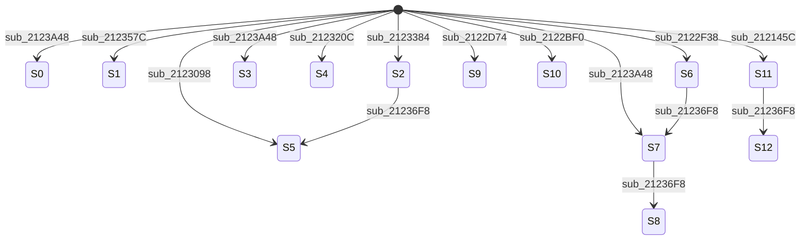

| from | to | function | line | via |
|---|---|---|---|---|
| * | 0 | `arm9_main:sub_2123A48` | 79 |  |
| * | 1 | `arm9_main:sub_212357C` | 66 |  |
| * | 2 | `arm9_main:sub_2123384` | 94 |  |
| * | 3 | `arm9_main:sub_2123A48` | 163 |  |
| * | 4 | `arm9_main:sub_212320C` | 59 |  |
| * | 5 | `arm9_main:sub_2123098` | 58 |  |
| * | 6 | `arm9_main:sub_2122F38` | 51 |  |
| * | 7 | `arm9_main:sub_2123A48` | 111 |  |
| * | 9 | `arm9_main:sub_2122D74` | 65 |  |
| * | 10 | `arm9_main:sub_2122BF0` | 70 |  |
| * | 11 | `arm9_main:sub_212145C` | 49 |  |
| * | 11 | `arm9_main:sub_2121580` | 55 |  |
| * | 11 | `arm9_main:sub_21225AC` | 26 |  |
| * | 11 | `arm9_main:sub_21225AC` | 33 |  |
| * | 11 | `arm9_main:sub_2122960` | 31 |  |
| * | 11 | `arm9_main:sub_2122960` | 50 |  |
| * | 11 | `arm9_main:sub_212320C` | 26 |  |
| 11 | 12 | `arm9_main:sub_21236F8` | 153 |  |
| 2 | 5 | `arm9_main:sub_21236F8` | 62 |  |
| 6 | 7 | `arm9_main:sub_21236F8` | 102 |  |
| 7 | 8 | `arm9_main:sub_21236F8` | 136 |  |

## 4. `[[0x021759A0]:u32+0x8]:u32` (state_machine_computed, global)

States: 0, 1, 2, 3, 4, 5

Dispatch sites: `arm9_main:sub_203A520` L27 (4 cases); `arm9_main:sub_203A520` L118 (4 cases); `arm9_main:sub_203C2E4` L71 (4 cases); `arm9_main:sub_203CA38` L41 (4 cases); `arm9_main:sub_203D078` L71 (4 cases); `arm9_main:sub_203D21C` L30 (4 cases); `arm9_main:sub_203D568` L56 (3 cases); `arm9_main:sub_203D9D4` L204 (4 cases); `arm9_main:sub_203E788` L75 (4 cases); `arm9_main:sub_203EF58` L28 (6 cases); `arm9_main:sub_203FED4` L56 (4 cases); `arm9_main:sub_20401AC` L152 (3 cases); `arm9_main:sub_205EEB0` L12 (4 cases); `arm9_main:sub_20AEB7C` L75 (6 cases); `arm9_main:sub_20B3728` L37 (3 cases); `arm9_main:sub_20B3728` L71 (4 cases); `arm9_main:sub_20B8624` L299 (3 cases); `arm9_main:sub_20B8624` L326 (3 cases); `arm9_main:sub_20B8624` L369 (4 cases); `arm9_main:sub_20B9DFC` L47 (3 cases); `arm9_main:sub_20BE2F4` L16 (4 cases); `arm9_main:sub_20C5804` L16 (4 cases); `arm9_main:sub_20C5940` L37 (5 cases); `arm9_main:sub_20F1B10` L301 (3 cases); `arm9_main:sub_20F7EC8` L51 (6 cases); `arm9_main:sub_2105214` L22 (3 cases); `arm9_main:sub_2110E58` L11 (6 cases)

Non-constant writes: 1 (e.g. `arm9_main:sub_2044940` L146)

## 5. `[[0x0217A9E0]:u32+0x4]:u32` (state_machine, global)

States: 0, 1, 2, 3, 5, 6, 7, 8, 9, 10, 11, 12

Dispatch sites: `arm9_main:sub_2030B18` L122 (5 cases); `arm9_main:sub_204DB6C` L8 (3 cases); `arm9_main:sub_2055340` L28 (4 cases)

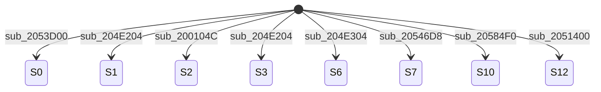

| from | to | function | line | via |
|---|---|---|---|---|
| * | 0 | `arm9_main:sub_2053D00` | 22 |  |
| * | 0 | `arm9_main:sub_20545E8` | 13 |  |
| * | 0 | `arm9_main:sub_2055030` | 80 |  |
| * | 1 | `arm9_main:sub_204E204` | 26 |  |
| * | 1 | `arm9_main:sub_204E29C` | 37 |  |
| * | 1 | `arm9_main:sub_2054C98` | 48 |  |
| * | 2 | `arm9_main:sub_200104C` | 9 |  |
| * | 3 | `arm9_main:sub_204E204` | 48 |  |
| * | 3 | `arm9_main:sub_2055808` | 43 |  |
| * | 6 | `arm9_main:sub_204E304` | 37 |  |
| * | 7 | `arm9_main:sub_20546D8` | 21 |  |
| * | 10 | `arm9_main:sub_20584F0` | 8 |  |
| * | 12 | `arm9_main:sub_2051400` | 16 |  |

## 6. `[0x0217D1EC]:u32` (state_machine, global)

States: 0, 1, 2, 3, 4, 5, 6, 7

Dispatch sites: `arm9_main:sub_2110114` L18 (4 cases)

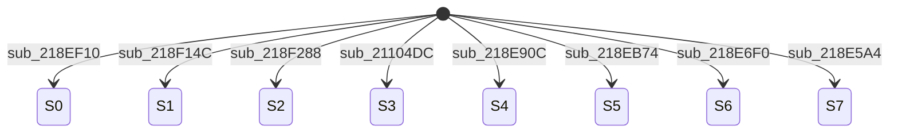

| from | to | function | line | via |
|---|---|---|---|---|
| * | 0 | `ov9_001:sub_218EF10` | 20 |  |
| * | 1 | `ov9_001:sub_218F14C` | 19 |  |
| * | 2 | `ov9_001:sub_218F288` | 21 |  |
| * | 3 | `arm9_main:sub_21104DC` | 14 |  |
| * | 3 | `ov9_001:sub_218E740` | 12 |  |
| * | 3 | `ov9_001:sub_218E7B0` | 20 |  |
| * | 3 | `ov9_001:sub_218E840` | 12 |  |
| * | 3 | `ov9_001:sub_218EAB0` | 38 |  |
| * | 4 | `ov9_001:sub_218E90C` | 31 |  |
| * | 5 | `ov9_001:sub_218EB74` | 19 |  |
| * | 5 | `ov9_001:sub_218EC20` | 62 |  |
| * | 6 | `ov9_001:sub_218E6F0` | 10 |  |
| * | 7 | `ov9_001:sub_218E5A4` | 17 |  |
| * | 7 | `ov9_001:sub_218E670` | 12 |  |

## 7. `[[0x02174E44]:u32+0x94]:u32` (state_machine, global)

States: 0, 1, 2, 3, 4, 5, 6, 7, 8, 9, 10, 11, 12, 13, 14, 15, 16

Dispatch sites: `arm9_main:sub_2034370` L78 (16 cases)

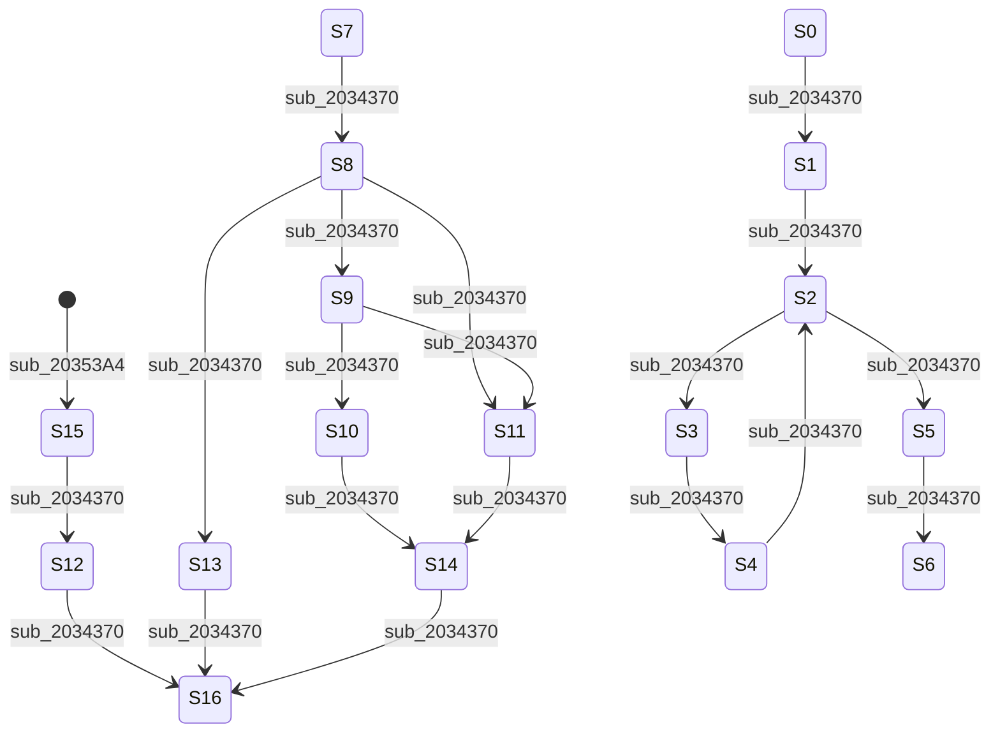

| from | to | function | line | via |
|---|---|---|---|---|
| * | 15 | `arm9_main:sub_20353A4` | 16 |  |
| 0 | 1 | `arm9_main:sub_2034370` | 86 |  |
| 10 | 14 | `arm9_main:sub_2034370` | 358 |  |
| 11 | 14 | `arm9_main:sub_2034370` | 380 |  |
| 12 | 16 | `arm9_main:sub_2034370` | 390 |  |
| 13 | 16 | `arm9_main:sub_2034370` | 397 |  |
| 14 | 16 | `arm9_main:sub_2034370` | 411 |  |
| 15 | 12 | `arm9_main:sub_2034370` | 421 |  |
| 1 | 2 | `arm9_main:sub_2034370` | 92 |  |
| 2 | 3 | `arm9_main:sub_2034370` | 178 |  |
| 2 | 3 | `arm9_main:sub_2034370` | 192 |  |
| 2 | 5 | `arm9_main:sub_2034370` | 105 |  |
| 3 | 4 | `arm9_main:sub_2034370` | 238 |  |
| 4 | 2 | `arm9_main:sub_2034370` | 254 |  |
| 5 | 6 | `arm9_main:sub_2034370` | 264 |  |
| 7 | 8 | `arm9_main:sub_2034370` | 287 |  |
| 8 | 9 | `arm9_main:sub_2034370` | 301 |  |
| 8 | 11 | `arm9_main:sub_2034370` | 321 |  |
| 8 | 13 | `arm9_main:sub_2034370` | 308 |  |
| 9 | 10 | `arm9_main:sub_2034370` | 336 |  |
| 9 | 11 | `arm9_main:sub_2034370` | 347 |  |

## 8. `[[0x02174E20]:u32+0xB0]:u32` (state_machine, global)

States: 0, 1, 2, 3, 4, 5, 6, 7, 8, 9, 10, 11, 13, 14

Dispatch sites: `arm9_main:sub_202CDF4` L41 (13 cases)

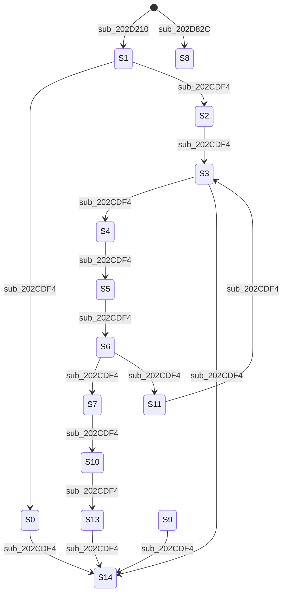

| from | to | function | line | via |
|---|---|---|---|---|
| * | 1 | `arm9_main:sub_202D210` | 192 |  |
| * | 8 | `arm9_main:sub_202D82C` | 9 |  |
| 0 | 14 | `arm9_main:sub_202CDF4` | 49 |  |
| 10 | 13 | `arm9_main:sub_202CDF4` | 197 |  |
| 11 | 3 | `arm9_main:sub_202CDF4` | 205 |  |
| 13 | 14 | `arm9_main:sub_202CDF4` | 214 |  |
| 1 | 0 | `arm9_main:sub_202CDF4` | 68 |  |
| 1 | 2 | `arm9_main:sub_202CDF4` | 61 |  |
| 2 | 3 | `arm9_main:sub_202CDF4` | 76 |  |
| 3 | 4 | `arm9_main:sub_202CDF4` | 103 |  |
| 3 | 14 | `arm9_main:sub_202CDF4` | 110 |  |
| 4 | 5 | `arm9_main:sub_202CDF4` | 129 |  |
| 5 | 6 | `arm9_main:sub_202CDF4` | 140 |  |
| 6 | 7 | `arm9_main:sub_202CDF4` | 159 |  |
| 6 | 11 | `arm9_main:sub_202CDF4` | 149 |  |
| 7 | 10 | `arm9_main:sub_202CDF4` | 169 |  |
| 9 | 14 | `arm9_main:sub_202CDF4` | 189 |  |

## 9. `[[0x021759A0]:u32]:u32` (state_machine_computed, global)

States: 1, 9, 10, 11, 12, 13, 14, 15, 16, 17, 18, 19, 20, 22, 23, 24, 25, 26, 27, 28, 29, 30, 31, 32, 33, 34, 35, 36, 37, 38, 39, 46, 48, 49, 50, 51

Dispatch sites: `arm9_main:sub_20A8A6C` L114 (3 cases); `arm9_main:sub_20B03BC` L154 (4 cases); `arm9_main:sub_20B6E00` L253 (27 cases); `arm9_main:sub_21062A8` L10 (15 cases); `arm9_main:sub_21074AC` L94 (3 cases); `arm9_main:sub_2110CC8` L46 (3 cases)

Non-constant writes: 2 (e.g. `arm9_main:sub_2044940` L144)

## 10. `[[0x021B5488]:u32+0x24]:u32` (state_machine, global)

States: 0, 1, 2, 3, 4, 5, 6

Dispatch sites: `ov9_000:sub_219B748` L41 (4 cases); `ov9_000:sub_219BEDC` L43 (6 cases)

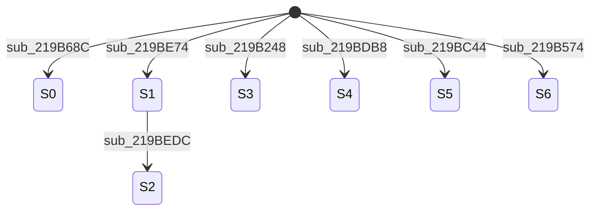

| from | to | function | line | via |
|---|---|---|---|---|
| * | 0 | `ov9_000:sub_219B68C` | 10 | sub_219B874 |
| * | 0 | `ov9_000:sub_219C1B0` | 31 |  |
| * | 1 | `ov9_000:sub_219BE74` | 18 | sub_219B874 |
| * | 3 | `ov9_000:sub_219B248` | 123 | sub_219B874 |
| * | 3 | `ov9_000:sub_219B574` | 27 | sub_219B874 |
| * | 3 | `ov9_000:sub_219B68C` | 15 | sub_219B874 |
| * | 3 | `ov9_000:sub_219BBC8` | 27 | sub_219B874 |
| * | 4 | `ov9_000:sub_219BDB8` | 33 | sub_219B874 |
| * | 5 | `ov9_000:sub_219BC44` | 28 | sub_219B874 |
| * | 5 | `ov9_000:sub_219BD5C` | 17 | sub_219B874 |
| * | 6 | `ov9_000:sub_219B574` | 12 | sub_219B874 |
| 1 | 2 | `ov9_000:sub_219BEDC` | 70 | sub_219B874 |

Non-constant writes: 1 (e.g. `ov9_000:sub_219B874` L8)

## 11. `[[0x021759A0]:u32+0x1F4]:u32` (state_machine, global)

States: 0, 1, 2, 3, 4, 5, 6

Dispatch sites: `arm9_main:sub_2044940` L87 (7 cases)

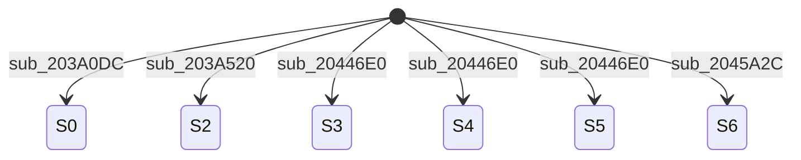

| from | to | function | line | via |
|---|---|---|---|---|
| * | 0 | `arm9_main:sub_203A0DC` | 76 | sub_203A3B8 |
| * | 0 | `arm9_main:sub_203A520` | 24 |  |
| * | 0 | `arm9_main:sub_20446E0` | 26 |  |
| * | 0 | `arm9_main:sub_20446E0` | 37 |  |
| * | 0 | `arm9_main:sub_2045590` | 30 |  |
| * | 0 | `arm9_main:sub_2045ED0` | 48 |  |
| * | 0 | `arm9_main:sub_2046024` | 64 |  |
| * | 2 | `arm9_main:sub_203A520` | 147 |  |
| * | 3 | `arm9_main:sub_20446E0` | 91 |  |
| * | 3 | `arm9_main:sub_2045ED0` | 22 |  |
| * | 3 | `arm9_main:sub_2046740` | 16 |  |
| * | 4 | `arm9_main:sub_20446E0` | 31 |  |
| * | 4 | `arm9_main:sub_2046024` | 72 |  |
| * | 5 | `arm9_main:sub_20446E0` | 45 |  |
| * | 5 | `arm9_main:sub_2045BD4` | 66 |  |
| * | 6 | `arm9_main:sub_2045A2C` | 32 |  |

Non-constant writes: 1 (e.g. `arm9_main:sub_203A3B8` L3)

## 12. `[[0x021759B0]:u32+0x20]:u32` (state_machine, global)

States: 0, 1, 2, 3, 4

Dispatch sites: `arm9_main:sub_202A360` L32 (4 cases); `arm9_main:sub_204AA60` L7 (4 cases); `arm9_main:sub_205DD38` L36 (5 cases)

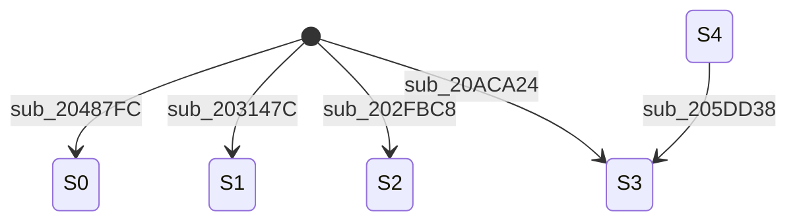

| from | to | function | line | via |
|---|---|---|---|---|
| * | 0 | `arm9_main:sub_20487FC` | 650 |  |
| * | 0 | `arm9_main:sub_204AD44` | 51 |  |
| * | 0 | `arm9_main:sub_20ACA24` | 27 | sub_20ACAB8 |
| * | 0 | `arm9_main:sub_20AD344` | 181 | sub_20ACAB8 |
| * | 0 | `ov9_000:sub_2180514` | 20 |  |
| * | 1 | `arm9_main:sub_203147C` | 18 |  |
| * | 2 | `arm9_main:sub_202FBC8` | 66 |  |
| * | 2 | `arm9_main:sub_205DC84` | 17 |  |
| * | 2 | `arm9_main:sub_20ACA24` | 34 | sub_20ACAB8 |
| * | 3 | `arm9_main:sub_20ACA24` | 38 | sub_20ACAB8 |
| 4 | 3 | `arm9_main:sub_205DD38` | 48 |  |

Non-constant writes: 1 (e.g. `arm9_main:sub_20ACAB8` L3)

## 13. `[[0x02174DF4]:u32+0x6C]:u32` (state_machine, global)

States: 0, 1, 2, 3, 4, 5, 6, 7, 8, 9

Dispatch sites: `arm9_main:sub_2026120` L57 (10 cases)

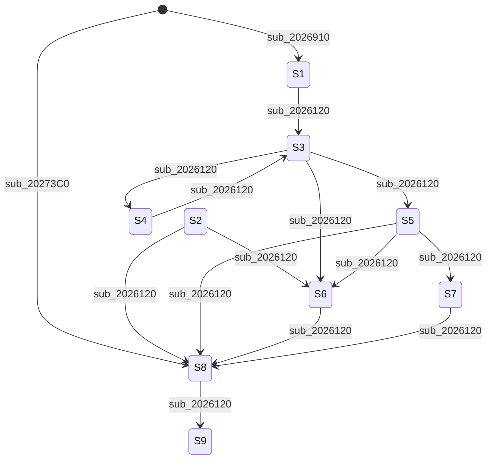

| from | to | function | line | via |
|---|---|---|---|---|
| * | 1 | `arm9_main:sub_2026910` | 459 |  |
| * | 8 | `arm9_main:sub_20273C0` | 10 |  |
| 1 | 3 | `arm9_main:sub_2026120` | 78 |  |
| 2 | 6 | `arm9_main:sub_2026120` | 102 |  |
| 2 | 8 | `arm9_main:sub_2026120` | 96 |  |
| 3 | 4 | `arm9_main:sub_2026120` | 180 |  |
| 3 | 5 | `arm9_main:sub_2026120` | 144 |  |
| 3 | 5 | `arm9_main:sub_2026120` | 216 |  |
| 3 | 6 | `arm9_main:sub_2026120` | 121 |  |
| 4 | 3 | `arm9_main:sub_2026120` | 278 |  |
| 5 | 6 | `arm9_main:sub_2026120` | 308 |  |
| 5 | 7 | `arm9_main:sub_2026120` | 329 |  |
| 5 | 8 | `arm9_main:sub_2026120` | 300 |  |
| 5 | 8 | `arm9_main:sub_2026120` | 316 |  |
| 5 | 8 | `arm9_main:sub_2026120` | 338 |  |
| 6 | 8 | `arm9_main:sub_2026120` | 357 |  |
| 7 | 8 | `arm9_main:sub_2026120` | 378 |  |
| 8 | 9 | `arm9_main:sub_2026120` | 391 |  |

## 14. `[(+ [0x021DA26C]:u32 [0x021D1150]:u32)]:u8` (state_machine, local)

States: 1, 2, 3, 4, 5, 6, 7, 8, 9, 10, 11, 16, 17, 18, 19, 20, 21, 22, 23, 24, 25, 26, 27, 28, 29, 30, 32, 33, 34

Dispatch sites: `ov9_003:sub_21D0EA0` L30 (24 cases)

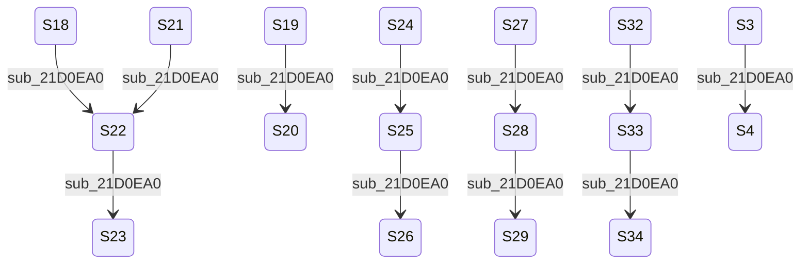

| from | to | function | line | via |
|---|---|---|---|---|
| 18 | 22 | `ov9_003:sub_21D0EA0` | 98 |  |
| 19 | 20 | `ov9_003:sub_21D0EA0` | 111 |  |
| 21 | 22 | `ov9_003:sub_21D0EA0` | 120 |  |
| 22 | 23 | `ov9_003:sub_21D0EA0` | 133 |  |
| 24 | 25 | `ov9_003:sub_21D0EA0` | 142 |  |
| 25 | 26 | `ov9_003:sub_21D0EA0` | 155 |  |
| 27 | 28 | `ov9_003:sub_21D0EA0` | 164 |  |
| 28 | 29 | `ov9_003:sub_21D0EA0` | 176 |  |
| 32 | 33 | `ov9_003:sub_21D0EA0` | 195 |  |
| 33 | 34 | `ov9_003:sub_21D0EA0` | 208 |  |
| 3 | 4 | `ov9_003:sub_21D0EA0` | 52 |  |

## 15. `[[0x021B4C24]:u32+0xC]:u32` (state_machine, global)

States: -1, 0, 1, 2, 3, 4, 5, 6, 7, 8, 9

Dispatch sites: `ov9_000:sub_21806F0` L27 (10 cases)

```mermaid
stateDiagram-v2
    [*] --> S-1 : sub_21806F0
    [*] --> S2 : sub_21857E4
    [*] --> S4 : sub_21849D8
    [*] --> S5 : sub_21848C0
    [*] --> S6 : sub_21848C0
    [*] --> S7 : sub_21848C0
```

| from | to | function | line | via |
|---|---|---|---|---|
| * | -1 | `ov9_000:sub_21806F0` | 66 |  |
| * | -1 | `ov9_000:sub_2180810` | 151 |  |
| * | 2 | `ov9_000:sub_21857E4` | 9 | sub_21806AC |
| * | 4 | `ov9_000:sub_21849D8` | 22 | sub_21806AC |
| * | 5 | `ov9_000:sub_21848C0` | 19 | sub_21806AC |
| * | 6 | `ov9_000:sub_21848C0` | 21 | sub_21806AC |
| * | 6 | `ov9_000:sub_21849D8` | 18 | sub_21806AC |
| * | 7 | `ov9_000:sub_21848C0` | 14 | sub_21806AC |
| * | 7 | `ov9_000:sub_21849D8` | 14 | sub_21806AC |
| * | 7 | `ov9_000:sub_2184A9C` | 17 | sub_21806AC |

Non-constant writes: 1 (e.g. `ov9_000:sub_21806AC` L3)

## 16. `[[0x0217B330]:u32+0x828]:u32` (state_machine, global)

States: 0, 1, 2, 3, 4, 5, 6

Dispatch sites: `arm9_main:sub_20AE824` L81 (7 cases); `arm9_main:sub_20AEB7C` L210 (7 cases); `arm9_main:sub_20AF66C` L86 (6 cases); `arm9_main:sub_20B0B8C` L173 (6 cases)

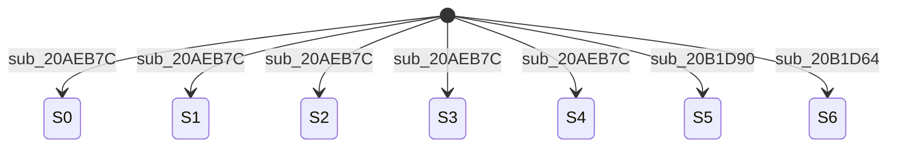

| from | to | function | line | via |
|---|---|---|---|---|
| * | 0 | `arm9_main:sub_20AEB7C` | 358 |  |
| * | 0 | `arm9_main:sub_20AEB7C` | 407 |  |
| * | 0 | `arm9_main:sub_20AEB7C` | 426 |  |
| * | 1 | `arm9_main:sub_20AEB7C` | 195 |  |
| * | 1 | `arm9_main:sub_20AEB7C` | 366 |  |
| * | 1 | `arm9_main:sub_20B03BC` | 132 |  |
| * | 2 | `arm9_main:sub_20AEB7C` | 173 |  |
| * | 3 | `arm9_main:sub_20AEB7C` | 414 |  |
| * | 4 | `arm9_main:sub_20AEB7C` | 270 |  |
| * | 4 | `arm9_main:sub_20AEB7C` | 440 |  |
| * | 5 | `arm9_main:sub_20B1D90` | 8 |  |
| * | 6 | `arm9_main:sub_20B1D64` | 8 |  |

## 17. `[[0x02174E38]:u32+0x70]:u32` (state_machine, global)

States: 0, 1, 2, 3, 4, 6, 7, 8

Dispatch sites: `arm9_main:sub_20317A0` L19 (5 cases); `arm9_main:sub_2031960` L19 (7 cases)

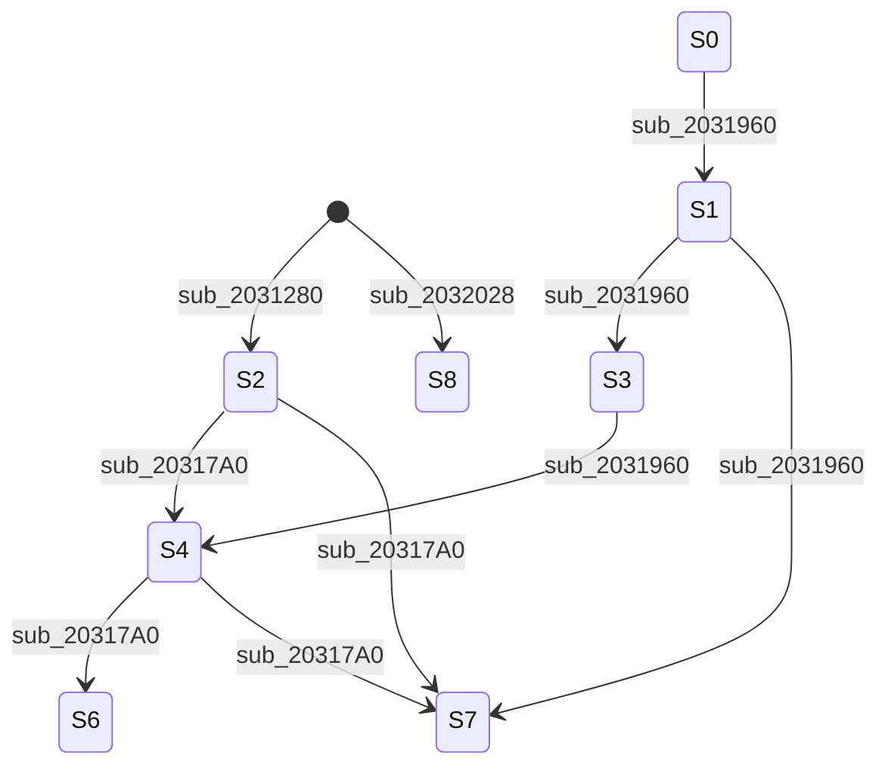

| from | to | function | line | via |
|---|---|---|---|---|
| * | 2 | `arm9_main:sub_2031280` | 46 |  |
| * | 8 | `arm9_main:sub_2032028` | 12 |  |
| 0 | 1 | `arm9_main:sub_2031960` | 26 |  |
| 1 | 3 | `arm9_main:sub_2031960` | 33 |  |
| 1 | 7 | `arm9_main:sub_2031960` | 43 |  |
| 2 | 4 | `arm9_main:sub_20317A0` | 37 |  |
| 2 | 7 | `arm9_main:sub_20317A0` | 26 |  |
| 3 | 4 | `arm9_main:sub_2031960` | 58 |  |
| 4 | 6 | `arm9_main:sub_20317A0` | 83 |  |
| 4 | 6 | `arm9_main:sub_2031960` | 89 |  |
| 4 | 7 | `arm9_main:sub_20317A0` | 57 |  |

## 18. `[[0x02174E3C]:u32+0x54]:u32` (state_machine, global)

States: 3, 4, 5, 6, 7, 8, 9, 10, 11

Dispatch sites: `arm9_main:sub_2032280` L43 (8 cases)

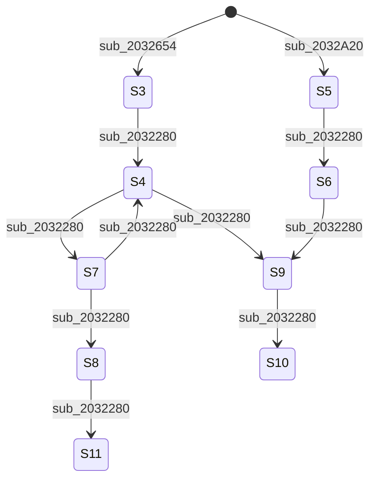

| from | to | function | line | via |
|---|---|---|---|---|
| * | 3 | `arm9_main:sub_2032654` | 53 |  |
| * | 5 | `arm9_main:sub_2032A20` | 25 |  |
| 3 | 4 | `arm9_main:sub_2032280` | 56 |  |
| 4 | 7 | `arm9_main:sub_2032280` | 106 |  |
| 4 | 9 | `arm9_main:sub_2032280` | 112 |  |
| 5 | 6 | `arm9_main:sub_2032280` | 177 |  |
| 6 | 9 | `arm9_main:sub_2032280` | 187 |  |
| 7 | 4 | `arm9_main:sub_2032280` | 209 |  |
| 7 | 8 | `arm9_main:sub_2032280` | 205 |  |
| 8 | 11 | `arm9_main:sub_2032280` | 219 |  |
| 9 | 10 | `arm9_main:sub_2032280` | 229 |  |

## 19. `[[0x0217B41C]:u32+0x8]:u32` (state_machine, global)

States: 4, 5, 6, 7, 8, 9, 10, 11, 12, 13, 14, 15, 16, 17, 18, 19, 20, 21, 22, 23, 24, 25, 26, 31

Dispatch sites: `arm9_main:sub_20CB618` L13 (23 cases)

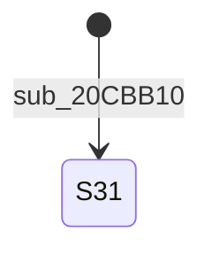

| from | to | function | line | via |
|---|---|---|---|---|
| * | 31 | `arm9_main:sub_20CBB10` | 60 |  |

Non-constant writes: 2 (e.g. `arm9_main:sub_20CB9B8` L16)

## 20. `[[0x0217D364]:u32+0x1F2C]:u32` (state_machine, global)

States: 1, 2, 3, 4, 5, 6, 7

Dispatch sites: `arm9_main:sub_211F91C` L7 (4 cases)

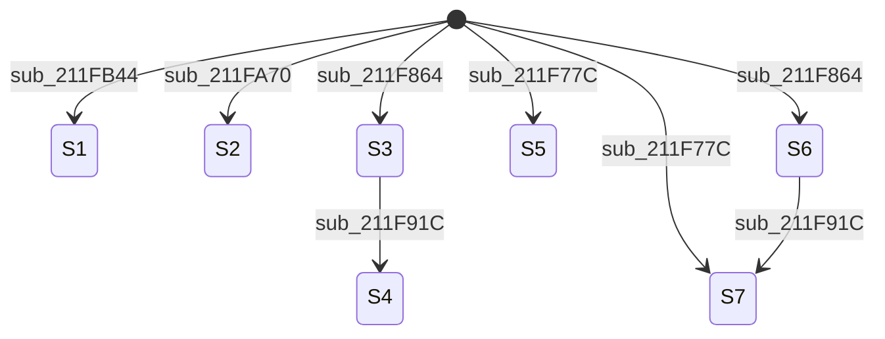

| from | to | function | line | via |
|---|---|---|---|---|
| * | 1 | `arm9_main:sub_211FB44` | 45 |  |
| * | 2 | `arm9_main:sub_211FA70` | 14 |  |
| * | 3 | `arm9_main:sub_211F864` | 20 |  |
| * | 5 | `arm9_main:sub_211F77C` | 43 |  |
| * | 6 | `arm9_main:sub_211F864` | 9 |  |
| * | 7 | `arm9_main:sub_211F77C` | 17 |  |
| * | 7 | `arm9_main:sub_211FA70` | 22 |  |
| 3 | 4 | `arm9_main:sub_211F91C` | 31 |  |
| 6 | 7 | `arm9_main:sub_211F91C` | 39 |  |

## 21. `[[0x021759A0]:u32+0x1F0]:u32` (state_machine, global)

States: 0, 1, 2, 3, 4, 5

Dispatch sites: `arm9_main:sub_2044940` L33 (6 cases); `arm9_main:sub_2045ED0` L15 (5 cases); `arm9_main:sub_2046594` L13 (4 cases)

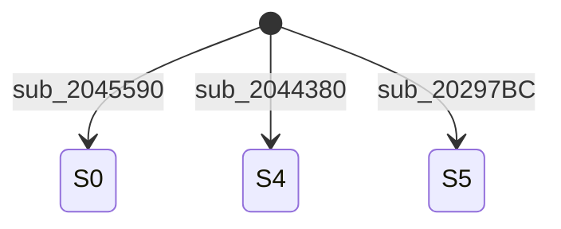

| from | to | function | line | via |
|---|---|---|---|---|
| * | 0 | `arm9_main:sub_2045590` | 29 |  |
| * | 4 | `arm9_main:sub_2044380` | 42 |  |
| * | 5 | `arm9_main:sub_20297BC` | 30 | sub_2029908 |

Non-constant writes: 2 (e.g. `arm9_main:sub_2029908` L3)

## 22. `[[0x0217D348]:u32+0x2C]:u32` (state_machine, global)

States: 0, 1, 2, 3, 4, 5

Dispatch sites: `arm9_main:sub_211B2CC` L198 (4 cases); `arm9_main:sub_211B2CC` L220 (6 cases); `arm9_main:sub_211B2CC` L247 (5 cases); `arm9_main:sub_211B2CC` L297 (4 cases); `arm9_main:sub_211BD10` L13 (6 cases); `arm9_main:sub_211BD84` L40 (6 cases); `arm9_main:sub_211CE24` L13 (6 cases); `arm9_main:sub_211CEA8` L18 (6 cases); `arm9_main:sub_211CFD0` L31 (6 cases); `arm9_main:sub_211D09C` L27 (6 cases); `arm9_main:sub_211D2F0` L17 (6 cases)


| from | to | function | line | via |
|---|---|---|---|---|
| * | 1 | `arm9_main:sub_20CB6C0` | 143 | sub_211B2CC |

Non-constant writes: 1 (e.g. `arm9_main:sub_211B2CC` L58)

## 23. `[[0x021B561C]:u32+0x4]:u32` (state_machine, global)

States: 0, 1, 2, 3, 4, 5

Dispatch sites: `ov9_000:sub_219C9A4` L22 (4 cases)

```mermaid
stateDiagram-v2
    [*] --> S0 : sub_219C908
    [*] --> S1 : sub_219C3CC
    [*] --> S4 : sub_219C3CC
    [*] --> S5 : sub_219C7EC
```

| from | to | function | line | via |
|---|---|---|---|---|
| * | 0 | `ov9_000:sub_219C908` | 9 |  |
| * | 0 | `ov9_000:sub_219CA78` | 11 |  |
| * | 1 | `ov9_000:sub_219C3CC` | 26 |  |
| * | 1 | `ov9_000:sub_219CA50` | 9 |  |
| * | 4 | `ov9_000:sub_219C3CC` | 35 |  |
| * | 5 | `ov9_000:sub_219C7EC` | 43 |  |

Non-constant writes: 1 (e.g. `ov9_000:sub_219C768` L27)

## 24. `[[0x02174DF8]:u32+0x94]:u32` (state_machine, global)

States: 0, 1, 2, 3, 4, 5, 6, 7, 8

Dispatch sites: `arm9_main:sub_2028130` L54 (9 cases)

```mermaid
stateDiagram-v2
    S0 --> S2 : sub_2028130
    S1 --> S5 : sub_2028130
    S2 --> S3 : sub_2028130
    S2 --> S4 : sub_2028130
    S2 --> S7 : sub_2028130
    S3 --> S2 : sub_2028130
    S4 --> S5 : sub_2028130
    S4 --> S6 : sub_2028130
    S5 --> S6 : sub_2028130
    S6 --> S7 : sub_2028130
    S7 --> S8 : sub_2028130
```

| from | to | function | line | via |
|---|---|---|---|---|
| 0 | 2 | `arm9_main:sub_2028130` | 64 |  |
| 1 | 5 | `arm9_main:sub_2028130` | 71 |  |
| 2 | 3 | `arm9_main:sub_2028130` | 126 |  |
| 2 | 4 | `arm9_main:sub_2028130` | 85 |  |
| 2 | 7 | `arm9_main:sub_2028130` | 103 |  |
| 3 | 2 | `arm9_main:sub_2028130` | 144 |  |
| 4 | 5 | `arm9_main:sub_2028130` | 164 |  |
| 4 | 5 | `arm9_main:sub_2028130` | 170 |  |
| 4 | 6 | `arm9_main:sub_2028130` | 178 |  |
| 5 | 6 | `arm9_main:sub_2028130` | 190 |  |
| 6 | 7 | `arm9_main:sub_2028130` | 211 |  |
| 7 | 8 | `arm9_main:sub_2028130` | 220 |  |

## 25. `[[0x021759AC]:u32+0x118]:u32` (state_machine, global)

States: -1, 0, 1, 2, 3, 4, 5

Dispatch sites: `arm9_main:sub_2049F60` L42 (5 cases); `arm9_main:sub_204A1A8` L42 (5 cases)

```mermaid
stateDiagram-v2
    [*] --> S-1 : sub_20487FC
    [*] --> S0 : sub_20487FC
    [*] --> S3 : sub_20487FC
    [*] --> S4 : sub_204984C
```

| from | to | function | line | via |
|---|---|---|---|---|
| * | -1 | `arm9_main:sub_20487FC` | 177 |  |
| * | -1 | `arm9_main:sub_2049C3C` | 19 |  |
| * | 0 | `arm9_main:sub_20487FC` | 493 | sub_2049E38 |
| * | 0 | `arm9_main:sub_204984C` | 74 | sub_2049E38 |
| * | 3 | `arm9_main:sub_20487FC` | 226 | sub_2049E38 |
| * | 3 | `arm9_main:sub_20487FC` | 341 | sub_2049E38 |
| * | 3 | `arm9_main:sub_20487FC` | 506 | sub_2049E38 |
| * | 4 | `arm9_main:sub_204984C` | 39 | sub_2049E38 |

Non-constant writes: 1 (e.g. `arm9_main:sub_2049E38` L35)
