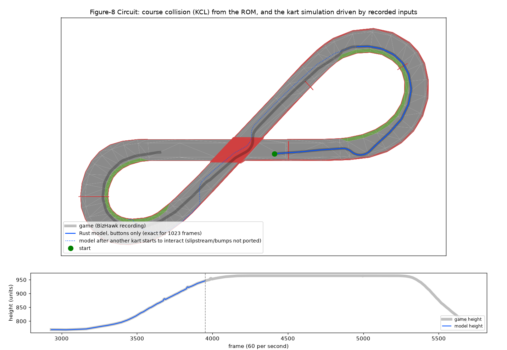

# Kart simulation port: changes and findings



*Figure-8 Circuit seen from above: road (grey), off-road (green), walls (red outline), and the
bridge sides where the track crosses itself (red block). The thick grey line is the path the
real game drove (recorded in BizHawk). The blue line is the Rust model driven by **only the
recorded button presses**. In this picture it sits exactly on the game's path for 1,023 frames,
including the 200-unit climb (bottom panel), up to the first slipstream. With slipstreams and
bumps and items now ported, the whole recording (2,751 frames, through a lightning strike) and a
second two-lap items session (5,639 frames) replay exactly.
Regenerate with `cargo run --example trace_session` + `tools/plot_trace.py`.*

## What exists now

`vm_model` (Rust crate) contains a clean-room, fixed-point re-implementation of a Mario Kart DS
kart, verified frame by frame against the real game:

| Module | What it does |
|---|---|
| `kart/mod.rs` | per-tick order (`step`), input, hop, drift, mini-turbo, components |
| `kart/speed.rs` | speed limit, acceleration curve, boost, friction, speed cap |
| `kart/steer.rs` | steering → turn rate → yaw, hop turn, A+B pivot |
| `kart/movement.rs` | facing/travel direction, velocity, position, ground contact, slopes, walls, orientation |
| `kart/kcl.rs` | course collision file parser and the game's sphere test |
| `kart/traffic.rs` | the game's sweep-and-prune broadphase, kart-to-kart bumps |
| `kart/slipstream.rs` | slipstream detection, speed factor and boost |
| `kart/damage.rs` | being hit: spin-outs, shell tumbles, lightning's shrink, the control lock |
| `kart/items.rs` | mushrooms, item hits |
| `kart/hand.rs` | holding items behind the kart, throwing shells, dropping bananas |
| `kart/shell.rs`, `kart/red_shell.rs`, `kart/route.rs` | shells in flight, red-shell route following and homing |
| `kart/banana.rs` | dropped bananas: flight, landing, lying on the ground |
| `race.rs` | checkpoints, laps, key checkpoints, race progress and places (replay-exact) |
| `cpu.rs` | CPU drivers: start grid, route following, yaw controller (exact on recorded CPUs), drifting, skill by rank and class, rubber-banding (pace) |
| `roster.rs` | characters and karts: model files and stats built like the game (exact for Mario) |
| `start.rs` | the start boost charge and its outcome |
| `item_slot.rs` | the item roulette's odds tables and draw |
| `nitro.rs` | NSBMD/NSBTX models and textures (all DS texture formats) |
| `sound.rs` | SDAT music: sequences, instrument banks, samples, a DS-style synth |
| `course_map.rs` | NKM course maps: start/respawn points, checkpoints, routes, objects, paths |
| `kart/fxmath.rs` | the SDK's fixed-point math, with its exact rounding |
| `assets.rs` | reads the user's `.nds` at run time (file system, LZ77, NARC); nothing is embedded |
| `kart_plugin.rs` | Bevy plugin: `FixedUpdate` systems, `TrackGround` resource, `KartMessage` events |

Everything is integer arithmetic, so a run depends only on inputs + course data (deterministic).

## How it was verified

1. **Static analysis:** IDA exports, plus `tools/arm_disasm.py` (Capstone) where IDA split or mis-decoded ARM code as Thumb.
2. **Runtime evidence:** BizHawk (melonDS core) Lua tools in `tools/bizhawk/`.
   - `autodrive.lua` drives the game unattended: scripted inputs, a closed-loop wait on a kart field, an autopilot along the course's CPU line, savestates, and screenshots.
   - It also has a write-watch mode that records which instruction writes a field.
   - `kart_logger_lib.lua` logs the full kart struct every frame.
3. **Fixtures and replays:** `make_kart_fixture.py` / `make_contact_fixture.py` turn the logs into test fixtures. The tests replay them with only the buttons fed in and require **exact** equality on every field, every frame.

| Test | Frames | Result |
|---|---|---|
| SNES Mario Circuit 1: speed, hop, drift, mini-turbo session | 317 | exact |
| SNES Mario Circuit 1: steering, braking, A+B pivots | 472 | exact |
| SNES Mario Circuit 1: driving into and scraping along walls | 2,695 | exact |
| Figure-8 Circuit: autopilot lap among 7 CPU karts (slopes, hops, slipstreams, 16 bump frames, struck by lightning) | 2,751 | exact; CPU karts are taken from the recording |
| Figure-8 Circuit: two laps using every item (5 mushrooms, hit by 2 shells and a banana) | 5,639 | exact; item use and hits are taken from the recording |
| Sphere test vs. the game's push-outs (both courses) | 5,284 | exact (frames near other karts excluded) |

## Key realizations

- **Order matters as much as maths.** Exactness came from matching the game's per-tick order:
  1. speed limit, speed ratio, heading;
  2. pedals, pivot, steering;
  3. hop and drift;
  4. acceleration, then turn;
  5. mini-turbo countdown;
  6. movement;
  7. collision, then orientation rebuild.

  Many values are read one tick late (heading, sphere position, ground normal).
- **Rounding is part of the behaviour.** The DS hardware divider and square root round, while most multiplies truncate. Matching that took replays from "1 unit off" to exact. The sin/cos and atan tables are exactly `round(sin·4096)` and `round(atan(i/128)·4096)`, so they're computed rather than copied.
- **Two speeds.** `+0x2A8` is the speed that acceleration changes; `+0x2A4` is the length of the 3D velocity. Drift and acceleration checks use the second.
- **The "4182" mystery:** on flat ground the vertical speed rests at −3485 and gravity adds −697 each frame, so the kart presses into the ground at 4182 and collision pushes it back.
- **Hops:** a hop adds 8610 to vertical speed. The 5125 bounce is visual only, and the hop ends when that visual bounce ends, not on touchdown.
- **Collision sphere:** radius 45056, centred along the body's up axis, so it tilts during hops. The previous-frame centre carries over, which matters when the kart is shrunk by lightning (radius × 0.7).
- **Surfaces** come from the collision type of the floor triangle. Each kart has a per-surface grip and speed table, and grip is what makes the kart slide.
- **Walls:** a hit lowers the speed cap for that frame depending on how head-on it is, adds a bounce that reaches the velocity two frames later, a yaw kick away from the wall, and a slide along it, and cancels boosts.

- **Karts near each other** are found through the game's broadphase: each kart owns a contact box and a slipstream zone 4 radii behind it. Sort order and the quantized x endpoints decide the order in which karts are checked, so they're ported exactly.
- **Bumps:** two contact spheres (radius 45056, centred 33792 above the kart) that overlap push each kart out by half the overlap. Each is knocked sideways by `weight_other × min(weight ratio, 5) × speed factor`, through the same bounce vector walls use. A kart that was bumped doesn't snap to a stop on the next tick. Kart 0 updates first, so it meets the others where they were at the end of the previous frame.
- **Slipstream:** one kart per tick (round-robin) checks whether it sits in another kart's cone. More than 15 checks in a row, closer than 60 units, gives a 180-tick boost.

- **Damage** (+0x180) is one state machine for every hit. While damaged, steering, drift and acceleration are skipped, friction applies every tick, and the controller is masked from the next input read. Buttons still held when the mask lifts count as fresh presses.
  - **Spin** (bananas: 1 turn, lightning: 2 turns at 1872/tick): only the model turns. Control returns 10 ticks after it stops.
  - **Tumble** (shells): speed +2048 then ×0.6, thrown up at 9421, bounces 7373 and 4096 on landing, a flip that slows by 10/tick, then 30 ticks of waiting. The flip turns the *collision sphere* with the body: the game keeps a second matrix for that (+0x150), so a tumbling kart touches the road early.
- **Lightning** shrinks the kart to 0.7 (radius and speed cap) for 510…90 ticks by race place (the leader longest), plus a 25-tick grow-back. It lands after the karts' update in the frame it is used.
- **Mushroom:** a 90-tick boost that ignores terrain, plus 90 ticks in which bumps push twice as hard.
- **Item boxes do nothing physical**; touching one only starts the roulette.
- **Long airtime** (found through the tumble): after 5 airborne ticks, velocity is scaled by how well the nose points along it (at least 0.7). A long or high fall bounces back at 0.6 of the impact speed.

- **CPU drivers** steer by writing yaw directly (heading error x 164/4096, scaled by speed), not
  through the stick. Their hops swing twice as far as the player's (kart +0x7C bit 2), they hold
  the drift direction only during the hop, and while drifting they measure the heading against the
  facing direction. Holding the direction through the whole drift (an early port) doubled the
  drift's turn rate and sent CPUs into the water on Mario Circuit.
- **Rubber-banding** overwrites a CPU's speed target every tick (between the target and the eased
  limit): from its rank and place among the CPUs (two rivals ranked 1 and 2), the gap to the CPU
  ahead and to the leading CPU, and a cap when turning more than 5 degrees off its target.
  Difficulty per course and class comes from `kartAIparam.bin`; distances are race progress x
  (summed checkpoint lengths / 15000).
- **Jump pads** (type 12): vertical speed and a speed target by the floor's variant, +4096 forward
  speed a tick until landing; CPU drivers don't override the target meanwhile.
- **Star:** speed target 1.2 x top speed regardless of terrain (+0x4C bit 0x40), 451 ticks.

## Corrections made along the way

- The recordings first thought to be Figure-8 were on **SNES Mario Circuit 1**. The menu defaults to the Shell Cup; found by matching the game's live collision header.
- `+0xEC` is a quaternion component, not "steering".
- `+0x380` counts airborne frames, not frames since the start.
- Braking in reverse is capped at 12288, not top speed.
- `+0xD8` is the **slipstream** speed factor, not a slope term.

## Not ported yet

- Bump special cases: star / mega mushroom, the bump sound/spin visuals, battle mode.
- CPU drivers: random target offsets, item use, the start-boost decision. (In the replay tests the other karts' motion still comes from recordings.)
- Items: shells and bananas are ported from pickup to hit or rest, but are not yet wired into the Bevy plugin (hits are still fed in from recordings). Chains of held items (triple shells, banana bunches), forward banana throws, fake item boxes, stars, bob-ombs, blue shells, bullet bills, the item roulette.
- Map objects that push or block.
- Map objects such as trees.
- Rendering. `KartPose::world_position()` / `world_basis()` give floats ready for it.

## Running

```
cd vm_model
cargo test --features bevy           # all tests; ROM/asset tests skip if files are missing
MKDS_ROM=path/to/game.nds cargo test # point at a ROM elsewhere
cargo run --example trace_session -- tests/data/kart_figure8_session.csv \
    ../gamefile_assets/unpacked/data/Course/cross_course/course_collision.kcl > trace.csv
python ../tools/plot_trace.py <kcl> trace.csv ../docs/figure8_simulation.png
```

Detailed field-by-field notes are in `analysis/race_logic_map.md`.
